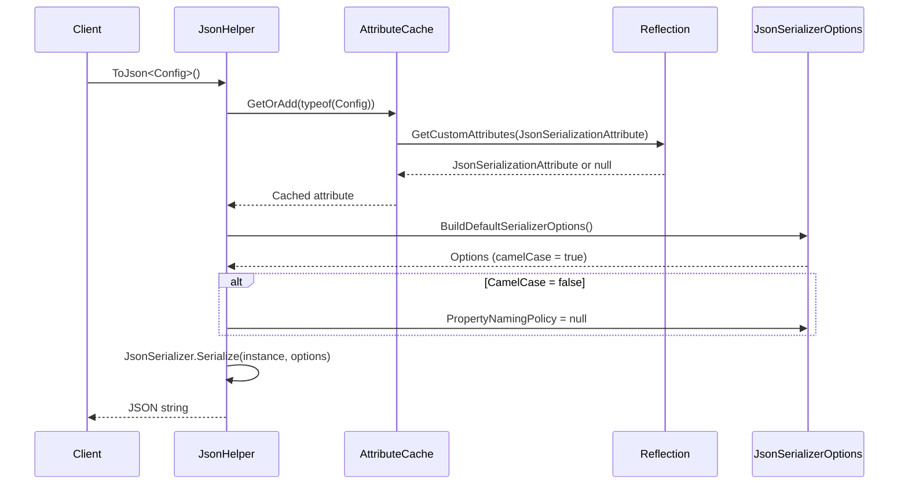

# Attributes

## Contents
- [Overview](#overview)
- [Files](#files)
- [Types & Members](#types--members)
- [Diagrams](#diagrams)
- [Examples](#examples)
- [See Also](#see-also)

## Overview

The Attributes namespace provides custom attributes for controlling serialization behavior. The primary attribute is `JsonSerializationAttribute`, which controls JSON naming policies (camelCase vs PascalCase) at the type level, and `IgnoreMemberAttribute` for excluding properties from serialization.

## Files

| File | Primary Type(s) | LOC | Responsibility |
|------|-----------------|-----|----------------|
| [JsonSerializationAttribute.cs](../../../src/ThunderPropagator.BuildingBlocks.Application/Attributes/JsonSerializationAttribute.cs) | `JsonSerializationAttribute` | 15 | Controls JSON naming policy (camelCase toggle) |
| [IgnoreMemberAttribute.cs](../../../src/ThunderPropagator.BuildingBlocks.Application/Attributes/IgnoreMemberAttribute.cs) | `IgnoreMemberAttribute` | 12 | Marks properties to exclude from serialization |

## Types & Members

### Types Summary

| Type | Kind | Summary | Inherits/Implements | Key Members |
|------|------|---------|---------------------|-------------|
| `JsonSerializationAttribute` | Sealed Class (Debug: Non-Sealed) | Controls JSON naming policy for a type | `Attribute` | `CamelCase` property |
| `IgnoreMemberAttribute` | Sealed Class (Debug: Non-Sealed) | Marks members to exclude from serialization | `Attribute` | - |

[↑ Back to top](#contents)

### JsonSerializationAttribute

**Kind**: Sealed Class (Non-Sealed in DEBUG builds)  
**Namespace**: `ThunderPropagator.BuildingBlocks.Application.Attributes`

Controls JSON naming policy for a type. When applied to a class, it determines whether property names should be serialized in camelCase (default) or PascalCase.

**Attribute Targets**: `AttributeTargets.Class`

**Key Properties**:
- `bool CamelCase { get; set; } = true` — When true (default), uses camelCase; when false, uses PascalCase

**Usage with JsonHelper**:
- `JsonHelper.JsonSerializerOptions<T>()` inspects this attribute via reflection
- Cached in `ConcurrentDictionary<Type, JsonSerializationAttribute?>` for performance
- If `CamelCase = false`, sets `JsonSerializerOptions.PropertyNamingPolicy = null`

**Usage Recipe**:

```csharp
using ThunderPropagator.BuildingBlocks.Application.Attributes;
using ThunderPropagator.BuildingBlocks.Application.Helpers;

// Default: camelCase
public class UserProfile
{
    public string FirstName { get; set; } = string.Empty;
    public string LastName { get; set; } = string.Empty;
    public int UserId { get; set; }
}

var profile1 = new UserProfile
{
    FirstName = "John",
    LastName = "Doe",
    UserId = 123
};

var json1 = profile1.ToJson();
// Output: {"firstName":"John","lastName":"Doe","userId":123}

// Opt-out of camelCase
[JsonSerialization(CamelCase = false)]
public class DatabaseConfig
{
    public string ConnectionString { get; set; } = string.Empty;
    public int MaxPoolSize { get; set; }
    public bool EnableRetry { get; set; }
}

var config = new DatabaseConfig
{
    ConnectionString = "Server=localhost",
    MaxPoolSize = 100,
    EnableRetry = true
};

var json2 = config.ToJson();
// Output: {"ConnectionString":"Server=localhost","MaxPoolSize":100,"EnableRetry":true}
```

[↑ Back to top](#contents)

### IgnoreMemberAttribute

**Kind**: Sealed Class (Non-Sealed in DEBUG builds)  
**Namespace**: `ThunderPropagator.BuildingBlocks.Application.Attributes`

Marks properties or fields to exclude from serialization. Used internally by `FeederMessage` and other types to prevent exposing internal state.

**Attribute Targets**: All (commonly used on properties and fields)

**Usage in FeederMessage**:

```csharp
[IgnoreMember] 
private readonly ConcurrentDictionary<string, object?> _dictionary = [];
```

**Usage Recipe**:

```csharp
using ThunderPropagator.BuildingBlocks.Application.Attributes;

public class SecureData
{
    public string PublicId { get; set; } = string.Empty;
    public string Data { get; set; } = string.Empty;
    
    [IgnoreMember]
    public string InternalToken { get; set; } = string.Empty;
    
    [IgnoreMember]
    private string _encryptionKey = string.Empty;
}

// When serialized, InternalToken and _encryptionKey are excluded
```

[↑ Back to top](#contents)

## Diagrams

### Attribute-Driven Serialization Flow



### Attribute Hierarchy

```mermaid
classDiagram
    class Attribute {
        <<abstract>>
    }
    
    class JsonSerializationAttribute {
        +CamelCase: bool
    }
    
    class IgnoreMemberAttribute {
        (no properties)
    }
    
    Attribute <|-- JsonSerializationAttribute
    Attribute <|-- IgnoreMemberAttribute
    
    class FeederMessage {
        [JsonSerialization(CamelCase=false)]
        [IgnoreMember] _dictionary
    }
    
    JsonSerializationAttribute --> FeederMessage : applied to
    IgnoreMemberAttribute --> FeederMessage : applied to
```

## Examples

### Mixing Attributes

```csharp
using ThunderPropagator.BuildingBlocks.Application.Attributes;
using ThunderPropagator.BuildingBlocks.Application.Helpers;

[JsonSerialization(CamelCase = false)]
public class ApiResponse
{
    public int StatusCode { get; set; }
    public string Message { get; set; } = string.Empty;
    public object? Data { get; set; }
    
    [IgnoreMember]
    public DateTime ProcessedAt { get; set; } = DateTime.UtcNow;
    
    [IgnoreMember]
    internal string InternalTraceId { get; set; } = Guid.NewGuid().ToString();
}

var response = new ApiResponse
{
    StatusCode = 200,
    Message = "Success",
    Data = new { Id = 1, Name = "Test" },
    ProcessedAt = DateTime.UtcNow,
    InternalTraceId = "trace-123"
};

var json = response.ToJson();
// Output: {"StatusCode":200,"Message":"Success","Data":{"id":1,"name":"Test"}}
// Note: PascalCase for ApiResponse properties, but Data is camelCase (nested)
// ProcessedAt and InternalTraceId are excluded
```

### Custom Type with Attribute

```csharp
using ThunderPropagator.BuildingBlocks.Application;
using ThunderPropagator.BuildingBlocks.Application.Attributes;

[JsonSerialization(CamelCase = false)]
public class OrderCommand : FeederMessage
{
    public Guid OrderId
    {
        get => GetValueOrDefault(Guid.NewGuid());
        set => SetValue(value);
    }
    
    public decimal Amount
    {
        get => GetValueOrDefault(0m);
        set => SetValue(value);
    }
    
    [IgnoreMember]
    public DateTime CreatedAt
    {
        get => GetValueOrDefault(DateTime.UtcNow);
        set => SetValue(value);
    }
}

var order = new OrderCommand
{
    OrderId = Guid.NewGuid(),
    Amount = 99.99m,
    CorrelationId = "req-abc"
};

var json = order.ToJson();
// Output uses PascalCase: {"OrderId":"...","Amount":99.99,"CorrelationId":"req-abc"}
// CreatedAt is excluded due to [IgnoreMember]
```

## See Also

- [Application Layer](../README.md)
- [Helpers](../Helpers/README.md) — JsonHelper uses these attributes
- [FeederMessage](../README.md#feedermessage) — Uses JsonSerializationAttribute
- [Documentation Home](../../README.md)

[↑ Back to top](#contents)
