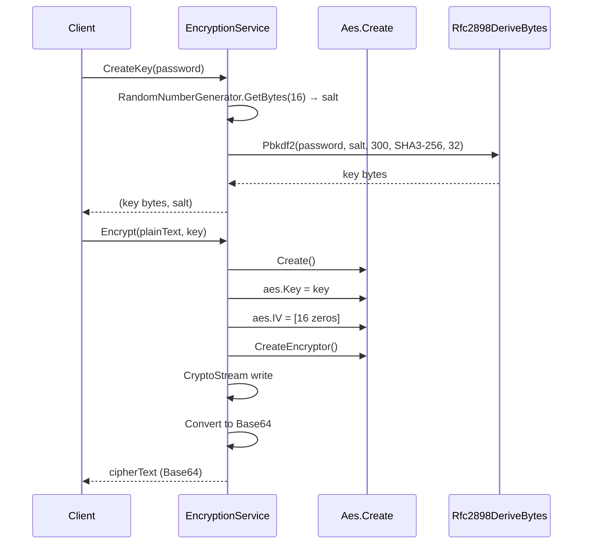
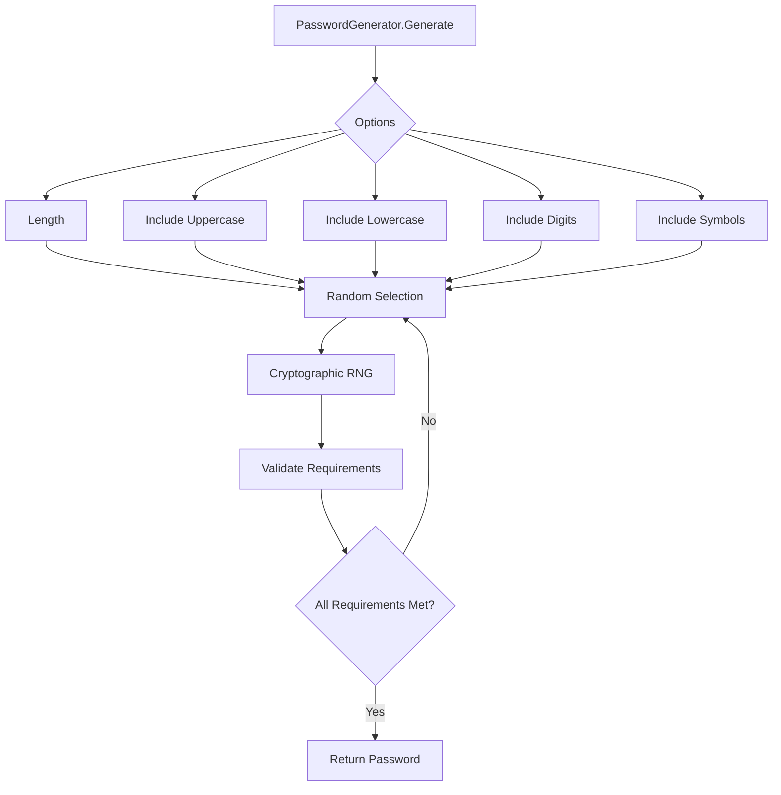

# Ciphering

## Contents
- [Overview](#overview)
- [Files](#files)
- [Types & Members](#types--members)
- [Diagrams](#diagrams)
- [Examples](#examples)
- [See Also](#see-also)

## Overview

Cryptography and security utilities including AES/RSA encryption services and secure password generation with configurable complexity.

## Files

| File | Primary Type(s) | LOC | Responsibility |
|------|-----------------|-----|----------------|
| [EncryptionService.cs](../../../src/ThunderPropagator.BuildingBlocks.Application/Ciphering/EncryptionService.cs) | `EncryptionService` | 80 | AES encryption/decryption with key derivation |
| [RsaEncryptionService.cs](../../../src/ThunderPropagator.BuildingBlocks.Application/Ciphering/RsaEncryptionService.cs) | `RsaEncryptionService` | 120 | RSA asymmetric encryption |
| [PasswordGenerator.cs](../../../src/ThunderPropagator.BuildingBlocks.Application/Ciphering/PasswordGenerator.cs) | `PasswordGenerator` | 90 | Secure password generation |

## Types & Members

### Types Summary

| Type | Kind | Summary | Inherits/Implements | Key Members |
|------|------|---------|---------------------|-------------|
| `EncryptionService` | Static Class | AES encryption with PBKDF2 key derivation | - | `Encrypt()`, `Decrypt()`, `CreateKey()` |
| `RsaEncryptionService` | Static Class | RSA asymmetric encryption with OAEP SHA-256 | - | `Encrypt()`, `Decrypt()`, `GenerateKeys()` |
| `PasswordGenerator` | Static Class | Secure password generation | - | `Generate()`, complexity options |

### EncryptionService

**Kind**: Static Class  
**Namespace**: `ThunderPropagator.BuildingBlocks.Application.Ciphering`

AES encryption service with PBKDF2 key derivation supporting SHA3-256.

**Key Methods**:
- `string Encrypt(string plainText, byte[] encryptionKeyBytes)` — Encrypts to Base64
- `string Decrypt(string cipherText, byte[] encryptionKeyBytes)` — Decrypts from Base64
- `(byte[] Key, byte[] Salt) CreateKey(string password, int keyBytes = 32, int iterations = 300, HashAlgorithmName? algorithmName = null)` — Derives a key with a freshly generated random salt; store the returned salt alongside the ciphertext
- `byte[] CreateKey(string password, byte[] salt, int keyBytes = 32, int iterations = 300, HashAlgorithmName? algorithmName = null)` — Re-derives the same key from a previously stored salt (use this during decryption)

**Key Derivation**:
- Uses `Rfc2898DeriveBytes.Pbkdf2` on .NET 10+
- Falls back to `Rfc2898DeriveBytes` on earlier versions
- Default: SHA3-256, 32 bytes (256-bit), 300 iterations
- Salt: 16 random bytes generated per call via `RandomNumberGenerator.GetBytes(16)`

**Usage Recipe**:

```csharp
using ThunderPropagator.BuildingBlocks.Application.Ciphering;

var password = "mySecurePassword123!";

// Encrypt — generate key with a unique random salt
var (key, salt) = EncryptionService.CreateKey(password);
var plainText = "Sensitive data here";
var encrypted = EncryptionService.Encrypt(plainText, key);

// Persist both `encrypted` and `salt` — they are both required for decryption.
Console.WriteLine($"Encrypted: {encrypted}");
Console.WriteLine($"Salt (Base64): {Convert.ToBase64String(salt)}");

// Decrypt — re-derive the same key using the stored salt
var reKey = EncryptionService.CreateKey(password, salt);
var decrypted = EncryptionService.Decrypt(encrypted, reKey);
Console.WriteLine($"Decrypted: {decrypted}"); // "Sensitive data here"

// Custom key derivation
var (strongKey, strongSalt) = EncryptionService.CreateKey(
    password,
    keyBytes: 32,
    iterations: 10000,
    algorithmName: HashAlgorithmName.SHA512);
```

[↑ Back to top](#contents)

## Diagrams

### AES Encryption Flow



### Password Generation



[↑ Back to top](#contents)

## Examples

### Encrypting Configuration Data

```csharp
using ThunderPropagator.BuildingBlocks.Application.Ciphering;
using ThunderPropagator.BuildingBlocks.Application.Helpers;

// Encrypt — generate a key with a unique random salt
var password = Environment.GetEnvironmentVariable("ENCRYPTION_KEY") ?? "default-key";
var (key, salt) = EncryptionService.CreateKey(password, iterations: 10000);

var config = new { ConnectionString = "Server=prod-db;Database=myapp", ApiKey = "secret-api-key-12345" };
var json = System.Text.Json.JsonSerializer.Serialize(config);

var encrypted = EncryptionService.Encrypt(json, key);

// Persist both ciphertext and salt (e.g., Base64-encode the salt and store alongside the encrypted value)
File.WriteAllText("config.encrypted", encrypted);
File.WriteAllText("config.salt", Convert.ToBase64String(salt));

// Later: decrypt — re-derive the key using the stored salt
var storedSalt = Convert.FromBase64String(File.ReadAllText("config.salt"));
var reKey = EncryptionService.CreateKey(password, storedSalt, iterations: 10000);
var decrypted = EncryptionService.Decrypt(File.ReadAllText("config.encrypted"), reKey);
Console.WriteLine($"Decrypted: {decrypted}");
```

### Generating Secure Passwords

```csharp
using ThunderPropagator.BuildingBlocks.Application.Ciphering;

// Simple password
var password = PasswordGenerator.Generate(length: 16);
Console.WriteLine($"Password: {password}");

// Complex password with all character types
var complexPassword = PasswordGenerator.Generate(
    length: 20,
    includeUppercase: true,
    includeLowercase: true,
    includeDigits: true,
    includeSymbols: true);
Console.WriteLine($"Complex password: {complexPassword}");

// PIN-style (digits only)
var pin = PasswordGenerator.Generate(
    length: 6,
    includeUppercase: false,
    includeLowercase: false,
    includeDigits: true,
    includeSymbols: false);
Console.WriteLine($"PIN: {pin}");
```

### RSA Key Exchange

```csharp
using ThunderPropagator.BuildingBlocks.Application.Ciphering;

// Generate RSA key pair
var (publicKey, privateKey) = RsaEncryptionService.GenerateKeys(keySize: 2048);

// Alice encrypts with Bob's public key
var message = "Secret message from Alice";
var encrypted = RsaEncryptionService.Encrypt(message, publicKey);

// Send encrypted message...

// Bob decrypts with his private key
var decrypted = RsaEncryptionService.Decrypt(encrypted, privateKey);
Console.WriteLine($"Decrypted: {decrypted}"); // "Secret message from Alice"
```

## See Also

- [Application Layer](../README.md)
- [Helpers](../Helpers/README.md)
- [Objects](../Objects/README.md)
- [Documentation Home](../../README.md)

[↑ Back to top](#contents)
