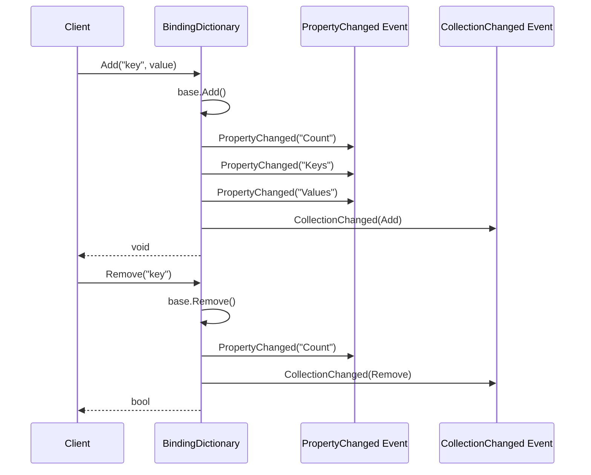
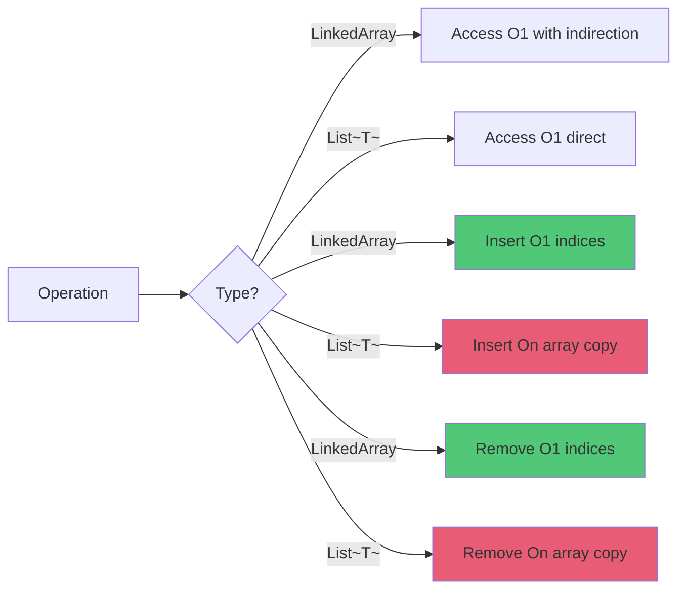

# Collections

## Contents
- [Overview](#overview)
- [Files](#files)
- [Types & Members](#types--members)
- [Diagrams](#diagrams)
- [Examples](#examples)
- [See Also](#see-also)

## Overview

Specialized collection types including `LinkedArray<T>` (array-backed list with index indirection for efficient insertion/removal), `BindingDictionary<TKey, TValue>` (dictionary with data binding support), and `GenericOrderedDictionary<TKey, TValue>` (ordered dictionary implementation).

## Files

| File | Primary Type(s) | LOC | Responsibility |
|------|-----------------|-----|----------------|
| [LinkedArray.cs](../../../src/ThunderPropagator.BuildingBlocks.Application/Collections/LinkedArray.cs) | `LinkedArray<T>` | 244 | Array-backed list with index indirection for efficient operations |
| [BindingDictionary.cs](../../../src/ThunderPropagator.BuildingBlocks.Application/Collections/BindingDictionary.cs) | `BindingDictionary<TKey, TValue>` | 180 | Dictionary with INotifyPropertyChanged support |
| [GenericOrderedDictionary.cs](../../../src/ThunderPropagator.BuildingBlocks.Application/Collections/GenericOrderedDictionary.cs) | `GenericOrderedDictionary<TKey, TValue>` | 220 | Ordered dictionary maintaining insertion order |

## Types & Members

### Types Summary

| Type | Kind | Summary | Inherits/Implements | Key Members |
|------|------|---------|---------------------|-------------|
| `LinkedArray<T>` | Class | Array-backed list with efficient insert/remove via index indirection | `IList<T>`, `IReadOnlyList<T>`, `ICollection<T>`, `IReadOnlyCollection<T>` | `this[index]`, `Filter()`, `ForEach()`, `ToArray()`, `Static Empty` |
| `BindingDictionary<TKey, TValue>` | Class | Observable dictionary with property change notifications | `Dictionary<TKey, TValue>`, `INotifyPropertyChanged`, `INotifyCollectionChanged` | `Add()`, `Remove()`, `Clear()`, Events |
| `GenericOrderedDictionary<TKey, TValue>` | Class | Dictionary maintaining insertion order | `IDictionary<TKey, TValue>`, `IOrderedDictionary` | Ordered enumeration, indexed access |

[↑ Back to top](#contents)

### LinkedArray<T>

**Kind**: Class  
**Namespace**: `ThunderPropagator.BuildingBlocks.Application.Collections`

Array-backed list that uses index indirection to provide efficient insertion and removal operations without reallocating the underlying array. Useful when you need list semantics but want to avoid frequent array copies.

**Implements**: `IList<T>`, `IReadOnlyList<T>`, `ICollection<T>`, `IReadOnlyCollection<T>`

**Key Properties**:
- `int Count` — Number of elements
- `bool IsReadOnly` — Always false
- `T this[int index]` — Indexer (get/set)
- `static LinkedArray<T> Empty` — Singleton empty instance

**Key Methods**:
- `void ForEach(Action<T> execution)` — Iterates with action
- `void ForEach(Action<int, T> execution)` — Iterates with index and action
- `TR[] ForEach<TR>(Func<T, TR> execution)` — Maps to new array
- `TR[] ForEach<TR>(Func<int, T, TR> execution)` — Maps with index
- `T[] ToArray()` — Converts to standard array
- `void CopyTo(T[] destination, int destinationIndex = 0)` — Copies elements

**Internal Structure**:
- `T[] _array` — Underlying storage array
- `List<int> _indices` — Indirection layer mapping logical index → array index

**Performance**:
- **Insert/Remove**: O(1) for index list manipulation, no array copy
- **Access**: O(1) with one extra indirection
- **Memory**: Extra space for index list

**Usage Recipe**:

```csharp
using ThunderPropagator.BuildingBlocks.Application.Collections;

// Create from array
var items = new[] { "apple", "banana", "cherry", "date" };
var linkedArray = new LinkedArray<string>(items);

// Efficient access
Console.WriteLine(linkedArray[0]); // "apple"
Console.WriteLine(linkedArray.Count); // 4

// Modify
linkedArray[1] = "blueberry";

// Iterate
linkedArray.ForEach((index, item) =>
{
    Console.WriteLine($"[{index}] = {item}");
});

// Map to new array
var lengths = linkedArray.ForEach(item => item.Length);
// lengths: [5, 9, 6, 4]

// Convert to standard array
var standardArray = linkedArray.ToArray();

// Empty singleton
var empty = LinkedArray<int>.Empty;
```

[↑ Back to top](#contents)

## Diagrams

### LinkedArray Structure

```mermaid
graph TD
    A[LinkedArray~T~] --> B[_array: T[]]
    A --> C[_indices: List~int~]
    
    B --> B1[0: apple]
    B --> B2[1: banana]
    B --> B3[2: cherry]
    B --> B4[3: date]
    
    C --> C1[0 → 0]
    C --> C2[1 → 1]
    C --> C3[2 → 2]
    C --> C4[3 → 3]
    
    D[Client: linkedArray[1]] --> C
    C --> B2
    
    style A fill:#4a90e2
    style B fill:#50c878
    style C fill:#e85d75
```

### BindingDictionary Event Flow



### LinkedArray vs List Performance



[↑ Back to top](#contents)

## Examples

### Using LinkedArray for Filtering

```csharp
using ThunderPropagator.BuildingBlocks.Application.Collections;
using ThunderPropagator.BuildingBlocks.Application.Helpers;

var numbers = Enumerable.Range(1, 1000).ToArray();

// Efficient filtering (returns LinkedArray)
var evens = numbers.Filter(n => n % 2 == 0);
Console.WriteLine($"Found {evens.Count} even numbers");

// Chain operations
var evensSquared = evens.ForEach(n => n * n);

// Convert back to array when needed
var finalArray = evensSquared;
```

### BindingDictionary in MVVM

```csharp
using ThunderPropagator.BuildingBlocks.Application.Collections;
using System.ComponentModel;

public class ConfigViewModel : INotifyPropertyChanged
{
    private readonly BindingDictionary<string, string> _settings;
    
    public BindingDictionary<string, string> Settings => _settings;
    
    public event PropertyChangedEventHandler? PropertyChanged;
    
    public ConfigViewModel()
    {
        _settings = new BindingDictionary<string, string>();
        
        // Subscribe to collection changes
        _settings.PropertyChanged += (sender, args) =>
        {
            Console.WriteLine($"Settings property changed: {args.PropertyName}");
            PropertyChanged?.Invoke(this, new PropertyChangedEventArgs(nameof(Settings)));
        };
    }
    
    public void UpdateSetting(string key, string value)
    {
        // This will trigger PropertyChanged events
        Settings[key] = value;
    }
}

// Usage
var viewModel = new ConfigViewModel();
viewModel.Settings.Add("Theme", "Dark");
viewModel.UpdateSetting("Language", "en-US");
// Both operations trigger PropertyChanged events for data binding
```

### GenericOrderedDictionary for Configuration

```csharp
using ThunderPropagator.BuildingBlocks.Application.Collections;

var config = new GenericOrderedDictionary<string, object>
{
    ["ServerUrl"] = "https://api.example.com",
    ["Timeout"] = 30,
    ["MaxRetries"] = 3,
    ["ApiKey"] = "secret-key-123"
};

// Enumerate in insertion order
foreach (var kvp in config)
{
    Console.WriteLine($"{kvp.Key} = {kvp.Value}");
}
// Output:
// ServerUrl = https://api.example.com
// Timeout = 30
// MaxRetries = 3
// ApiKey = secret-key-123

// Access by index
var firstKey = config.Keys.First();
var firstValue = config[firstKey];
```

## See Also

- [Application Layer](../README.md)
- [Helpers](../Helpers/README.md) — CollectionHelper works with these types
- [Objects](../Objects/README.md)
- [Documentation Home](../../README.md)

[↑ Back to top](#contents)
