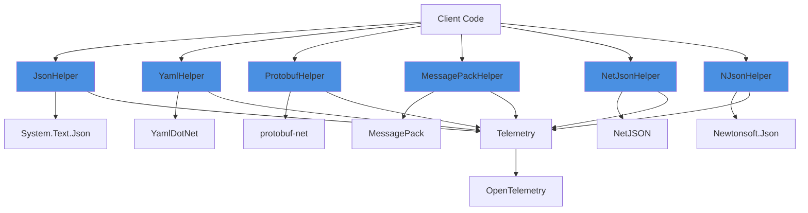
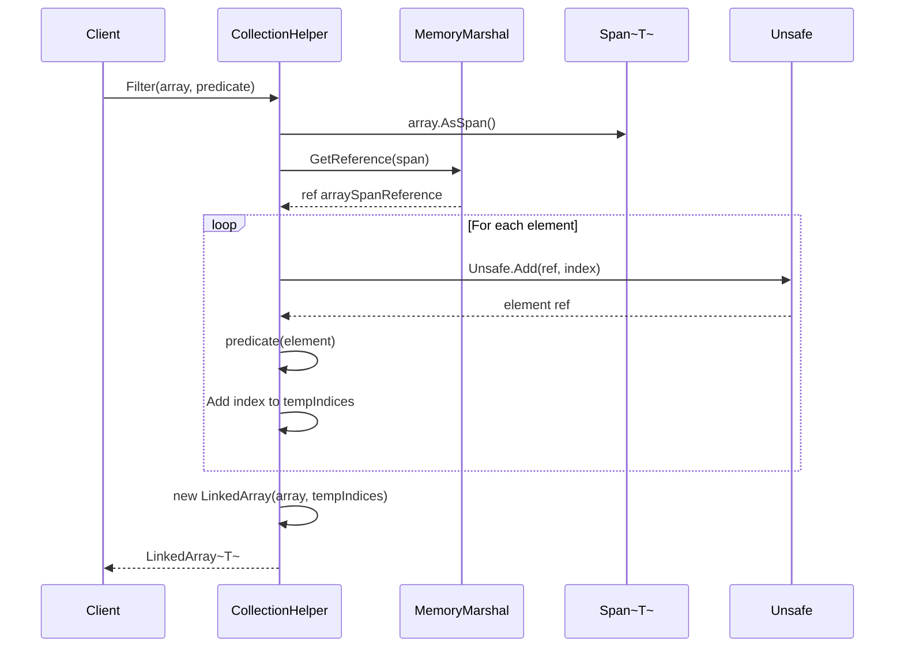
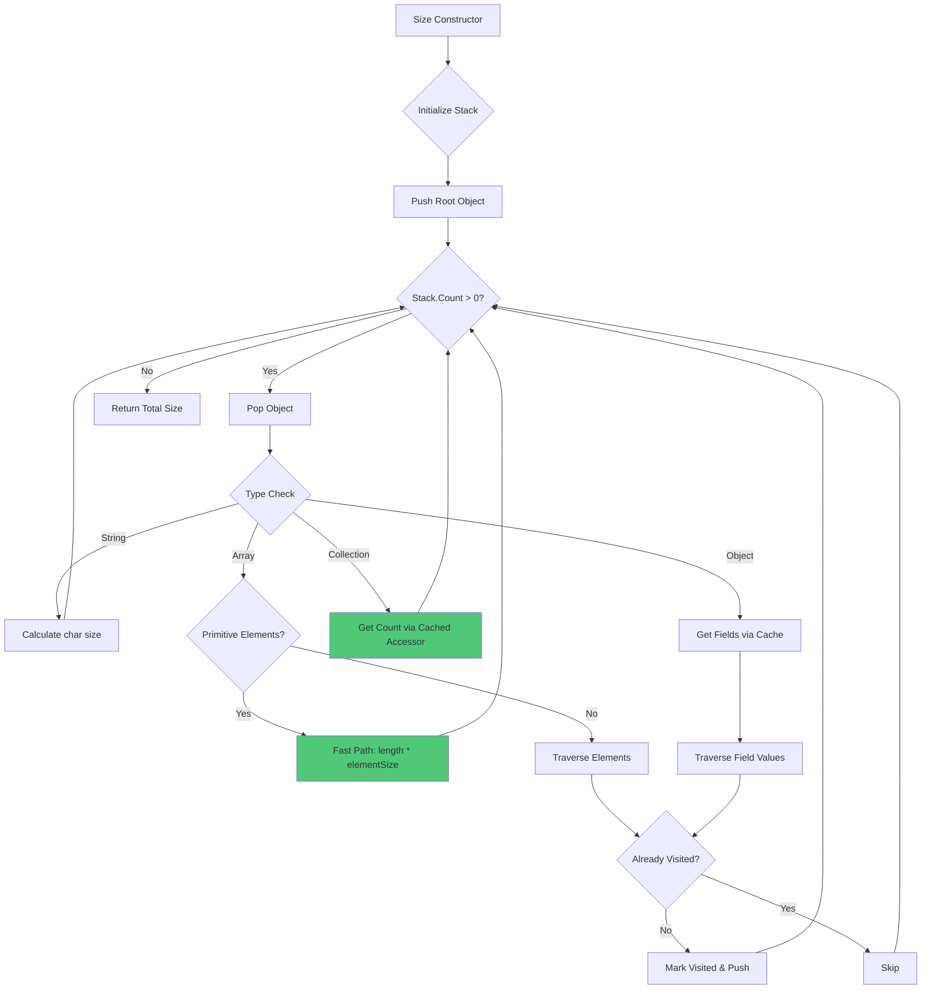
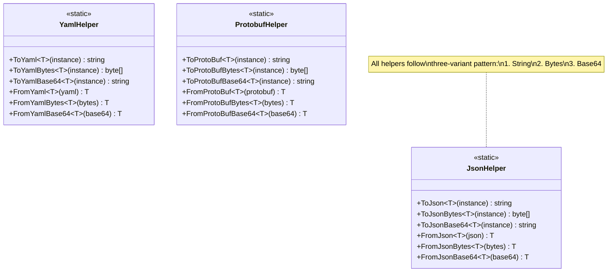

# Helpers

## Contents
- [Overview](#overview)
- [Files](#files)
- [Types & Members](#types--members)
- [Diagrams](#diagrams)
- [ThunderPropagator Dependencies](#thunderpropagator-dependencies)
- [Examples](#examples)
- [See Also](#see-also)

## Overview

The Helpers namespace provides comprehensive utility extensions for JSON, YAML, ProtoBuf, MessagePack, NetJSON, Newtonsoft.Json serialization, along with collection operations, string manipulation, date/time utilities, exception handling, guard clauses, object operations, and file size formatting. All helpers integrate OpenTelemetry telemetry tracking and follow a consistent three-variant pattern (string, bytes, base64) for serialization.

## Files

| File | Primary Type(s) | LOC | Responsibility |
|------|-----------------|-----|----------------|
| [JsonHelper.cs](../../../src/ThunderPropagator.BuildingBlocks.Application/Helpers/JsonHelper.cs) | `JsonHelper` | 157 | System.Text.Json serialization with attribute support |
| [YamlHelper.cs](../../../src/ThunderPropagator.BuildingBlocks.Application/Helpers/YamlHelper.cs) | `YamlHelper` | 140 | YamlDotNet serialization extensions |
| [ProtobufHelper.cs](../../../src/ThunderPropagator.BuildingBlocks.Application/Helpers/ProtobufHelper.cs) | `ProtobufHelper` | 130 | protobuf-net serialization extensions |
| [MessagePackHelper.cs](../../../src/ThunderPropagator.BuildingBlocks.Application/Helpers/MessagePackHelper.cs) | `MessagePackHelper` | 125 | MessagePack serialization extensions |
| [NetJsonHelper.cs](../../../src/ThunderPropagator.BuildingBlocks.Application/Helpers/NetJsonHelper.cs) | `NetJsonHelper` | 120 | NetJSON serialization extensions |
| [NJsonHelper.cs](../../../src/ThunderPropagator.BuildingBlocks.Application/Helpers/NJsonHelper.cs) | `NJsonHelper` | 135 | Newtonsoft.Json serialization extensions |
| [CollectionHelper.cs](../../../src/ThunderPropagator.BuildingBlocks.Application/Helpers/CollectionHelper.cs) | `CollectionHelper` | 178 | Collection operations with performance optimizations |
| [StringHelper.cs](../../../src/ThunderPropagator.BuildingBlocks.Application/Helpers/StringHelper.cs) | `StringHelper` | 150 | String conversion, compression (GZip, BZip2, Brotli, Deflate) |
| [DateTimeHelper.cs](../../../src/ThunderPropagator.BuildingBlocks.Application/Helpers/DateTimeHelper.cs) | `DateTimeHelper` | 50 | Date/time utilities (midnight detection with variance) |
| [ExceptionHelper.cs](../../../src/ThunderPropagator.BuildingBlocks.Application/Helpers/ExceptionHelper.cs) | `ExceptionHelper` | 80 | Exception handling and serialization |
| [GuardClauseHelper.cs](../../../src/ThunderPropagator.BuildingBlocks.Application/Helpers/GuardClauseHelper.cs) | `GuardClauseHelper` | 100 | Custom Ardalis.GuardClauses extensions |
| [ObjectHelper.cs](../../../src/ThunderPropagator.BuildingBlocks.Application/Helpers/ObjectHelper.cs) | `ObjectHelper` | 120 | Deep cloning, comparison, reflection utilities |
| [Size.cs](../../../src/ThunderPropagator.BuildingBlocks.Application/Helpers/Size.cs) | `Size` | 323 | Memory size calculation for objects with caching |
| [StreamHelper.cs](../../../src/ThunderPropagator.BuildingBlocks.Application/Helpers/StreamHelper.cs) | `StreamHelper` | 90 | Stream utilities and extensions |
| [ConnectionStringHelper.cs](../../../src/ThunderPropagator.BuildingBlocks.Application/Helpers/ConnectionStringHelper.cs) | `ConnectionStringHelper` | 70 | Connection string parsing and manipulation |
| [EnvironmentHelper.cs](../../../src/ThunderPropagator.BuildingBlocks.Application/Helpers/EnvironmentHelper.cs) | `EnvironmentHelper` | 60 | Environment variable utilities |
| [JwtIdentityHelper.cs](../../../src/ThunderPropagator.BuildingBlocks.Application/Helpers/JwtIdentityHelper.cs) | `JwtIdentityHelper` | 110 | JWT token creation and validation |
| [ToonHelper.cs](../../../src/ThunderPropagator.BuildingBlocks.Application/Helpers/ToonHelper.cs) | `ToonHelper` | 80 | ToonNet serialization extensions |

## Types & Members

### Types Summary

| Type | Kind | Summary | Inherits/Implements | Key Members |
|------|------|---------|---------------------|-------------|
| `JsonHelper` | Static Class | System.Text.Json extensions with attribute-driven naming | - | `ToJson<T>()`, `FromJson<T>()`, `ToJsonBytes<T>()`, `ToJsonBase64<T>()` |
| `YamlHelper` | Static Class | YamlDotNet serialization extensions | - | `ToYaml<T>()`, `FromYaml<T>()`, `ToYamlBytes<T>()`, `ToYamlBase64<T>()` |
| `ProtobufHelper` | Static Class | protobuf-net serialization extensions | - | `ToProtoBuf<T>()`, `FromProtoBuf<T>()`, `ToProtoBufBytes<T>()`, `ToProtoBufBase64<T>()` |
| `MessagePackHelper` | Static Class | MessagePack serialization extensions | - | `ToMessagePack<T>()`, `FromMessagePack<T>()`, `ToMessagePackBytes<T>()`, `ToMessagePackBase64<T>()` |
| `NetJsonHelper` | Static Class | NetJSON serialization extensions | - | `ToNetJson<T>()`, `FromNetJson<T>()`, `ToNetJsonBytes<T>()`, `ToNetJsonBase64<T>()` |
| `NJsonHelper` | Static Class | Newtonsoft.Json serialization extensions | - | `ToNJson<T>()`, `FromNJson<T>()`, `ToNJsonBytes<T>()`, `ToNJsonBase64<T>()` |
| `CollectionHelper` | Static Class | High-performance collection operations | - | `Filter<T>()`, `Convert<T, TR>()`, `Splice<T>()`, `ForEach<T>()` |
| `StringHelper` | Static Class | String conversion and compression | - | `ToByteArray()`, `ToBase64()`, `FromBase64()`, `DecompressString()` |
| `DateTimeHelper` | Static Class | Date/time utilities | - | `IsMidnight(variance)` |
| `ExceptionHelper` | Static Class | Exception utilities | - | `ToExceptionInfo()`, `GetFullMessage()` |
| `GuardClauseHelper` | Static Class | Guard clause extensions | - | Custom `Against.*` methods |
| `ObjectHelper` | Static Class | Object utilities | - | `DeepClone<T>()`, `IsEqual<T>()` |
| `Size` | Sealed Class | Memory size calculator | `DisposableObject` | Constructor(object), `Calculate()`, `PointerSize` |

[↑ Back to top](#contents)

### JsonHelper

**Kind**: Static Class  
**Namespace**: `ThunderPropagator.BuildingBlocks.Application.Helpers`

Provides System.Text.Json serialization extensions with attribute-driven naming policy control. Supports `[JsonSerialization(CamelCase = false)]` attribute for opt-out camelCase serialization.

**Key Methods**:
- `string ToJson<T>(this T instance, Func<JsonSerializerOptions, JsonSerializerOptions>? options = null)` — Serializes to JSON string
- `byte[] ToJsonBytes<T>(this T instance, Func<JsonSerializerOptions, JsonSerializerOptions>? options = null)` — Serializes to UTF-8 bytes
- `string ToJsonBase64<T>(this T instance, Func<JsonSerializerOptions, JsonSerializerOptions>? options = null)` — Serializes to Base64 string
- `T? FromJson<T>(this string json, Func<JsonSerializerOptions, JsonSerializerOptions>? options = null)` — Deserializes from JSON string
- `T? FromJsonBytes<T>(this byte[] bytes, Func<JsonSerializerOptions, JsonSerializerOptions>? options = null)` — Deserializes from UTF-8 bytes
- `T? FromJsonBase64<T>(this string base64, Func<JsonSerializerOptions, JsonSerializerOptions>? options = null)` — Deserializes from Base64 string

**Internal Methods**:
- `JsonSerializerOptions JsonSerializerOptions<T>(JsonSerializerOptions? serializerOptions = null)` — Builds options with attribute inspection
- `JsonSerializerOptions BuildDefaultSerializerOptions()` — Creates default options (camelCase, IgnoreCycles)

**Special Handling**:
- `Exception` types are converted to `ExceptionInfo` before serialization
- Attribute `[JsonSerialization(CamelCase = false)]` disables camelCase for that type
- Caches attribute lookups in `ConcurrentDictionary<Type, JsonSerializationAttribute?>`

**Usage Recipe**:

```csharp
using ThunderPropagator.BuildingBlocks.Application.Helpers;
using ThunderPropagator.BuildingBlocks.Application.Attributes;

[JsonSerialization(CamelCase = false)]
public class Config
{
    public string ConnectionString { get; set; }
    public int MaxRetries { get; set; }
}

var config = new Config
{
    ConnectionString = "Server=localhost",
    MaxRetries = 3
};

// Serialize (PascalCase because CamelCase = false)
var json = config.ToJson();
// {"ConnectionString":"Server=localhost","MaxRetries":3}

// With custom options
var customJson = config.ToJson(opts =>
{
    opts.WriteIndented = true;
    return opts;
});

// Bytes and Base64 variants
var bytes = config.ToJsonBytes();
var base64 = config.ToJsonBase64();

// Deserialize
var restored = json.FromJson<Config>();
var fromBytes = bytes.FromJsonBytes<Config>();
var fromBase64 = base64.FromJsonBase64<Config>();
```

[↑ Back to top](#contents)

### CollectionHelper

**Kind**: Static Class  
**Namespace**: `ThunderPropagator.BuildingBlocks.Application.Helpers`

High-performance collection operations using `Span<T>`, `MemoryMarshal`, and `Unsafe` for zero-allocation enumeration.

**Key Methods**:
- `LinkedArray<T> Filter<T>(this IEnumerable<T>? enumerable, Func<T, bool> func)` — Filters collection into LinkedArray
- `TR[]? Convert<T, TR>(this T[]? array, Func<T, TR> func)` — Converts array elements
- `IEnumerable<ArraySegment<T>> Splice<T>(this IEnumerable<T> enumerable, int count)` — Splits into segments
- `bool IsEquals<T>(this IEnumerable<T>? enumerable, IEnumerable<T>? other)` — Sequence equality check
- `void ForEach<T>(this IEnumerable<T>? collection, Action<T> action)` — Iterates with action
- `void ForEach<T>(this IEnumerable<T>? collection, Action<int, T> action)` — Iterates with index
- `TR[] ForEach<TR>(this IEnumerable<T> collection, Func<int, T, TR> func)` — Maps collection

**Performance Notes**:
- Uses `Span<T>` and `MemoryMarshal.GetReference()` for direct memory access
- `Unsafe.Add(ref arraySpanReference, index)` avoids bounds checks
- Special fast paths for `List<T>` and arrays

**Usage Recipe**:

```csharp
using ThunderPropagator.BuildingBlocks.Application.Helpers;
using ThunderPropagator.BuildingBlocks.Application.Collections;

var numbers = new[] { 1, 2, 3, 4, 5, 6, 7, 8, 9, 10 };

// Filter (returns LinkedArray)
var evens = numbers.Filter(n => n % 2 == 0);
// evens: [2, 4, 6, 8, 10]

// Convert
var doubled = numbers.Convert((idx, n) => n * 2);
// doubled: [2, 4, 6, 8, 10, 12, 14, 16, 18, 20]

// Splice (batching)
var batches = numbers.Splice(3).ToList();
// batches[0]: [1, 2, 3]
// batches[1]: [4, 5, 6]
// batches[2]: [7, 8, 9]
// batches[3]: [10]

// ForEach with index
numbers.ForEach((index, value) =>
{
    Console.WriteLine($"[{index}] = {value}");
});

// IsEquals
var numbers2 = new[] { 1, 2, 3, 4, 5, 6, 7, 8, 9, 10 };
var areEqual = numbers.IsEquals(numbers2); // true
```

[↑ Back to top](#contents)

### Size

**Kind**: Sealed Class  
**Namespace**: `ThunderPropagator.BuildingBlocks.Application.Helpers`

Calculates memory size of objects including referenced objects, using caching for field info and element sizes.

**Constants**:
- `int PointerSize` — Size of pointer (4 bytes for 32-bit, 8 bytes for 64-bit)

**Key Methods**:
- Constructor: `Size(object obj)` — Initializes with target object
- `long Calculate()` — Calculates total memory size including references

**Caching**:
- `ConcurrentDictionary<Type, FieldInfo[]> FieldCache` — Caches field info
- `ConcurrentDictionary<Type, Func<object, int>?> CountAccessorCache` — Caches Count property accessors
- `ConcurrentDictionary<Type, int> ElementPrimitiveSizeCache` — Caches element sizes for arrays

**Performance**:
- Fast paths for strings, arrays with primitive element types
- Stack-based traversal to avoid recursion
- `ReferenceEqualityComparer` to track visited objects

**Usage Recipe**:

```csharp
using ThunderPropagator.BuildingBlocks.Application.Helpers;

public class MyData
{
    public string Name { get; set; } = "Sample";
    public List<int> Numbers { get; set; } = new() { 1, 2, 3, 4, 5 };
    public Dictionary<string, object> Metadata { get; set; } = new();
}

var data = new MyData();
using var sizeCalculator = new Size(data);
var totalBytes = sizeCalculator.Calculate();

Console.WriteLine($"Object size: {totalBytes} bytes");

// Use Size for formatting (via implicit conversion)
var formatted = new Size(data);
// Can be converted to CompressedObject for storage
```

[↑ Back to top](#contents)

### StringHelper

**Kind**: Static Class  
**Namespace**: `ThunderPropagator.BuildingBlocks.Application.Helpers`

String conversion and compression utilities supporting GZip, BZip2, Brotli, and Deflate algorithms.

**Key Methods**:
- `byte[] ToByteArray(this string str)` — UTF-8 encoding
- `ReadOnlyMemory<byte> ToByteReadOnlyMemory(this string str)` — Read-only memory wrapper
- `string FromByteArray(this byte[] bytes)` — UTF-8 decoding
- `string ToBase64(this string str)` — Converts to Base64
- `string FromBase64(this string str)` — Converts from Base64
- `string DecompressString(this CompressedObject compressedObject, CompressionType compressionType)` — Decompresses compressed object

**Compression Types**:
- `GZipStream` — .NET built-in GZip
- `DeflateStream` — .NET built-in Deflate
- `BrotliStream` — .NET built-in Brotli
- `BZip2` — SharpZipLib BZip2
- `GZip` — SharpZipLib GZip

**Usage Recipe**:

```csharp
using ThunderPropagator.BuildingBlocks.Application.Helpers;
using ThunderPropagator.BuildingBlocks.Application.Objects;

var text = "Hello, World!";

// Byte conversions
var bytes = text.ToByteArray();
var memory = text.ToByteReadOnlyMemory();
var restored = bytes.FromByteArray();

// Base64
var base64 = text.ToBase64();
var fromBase64 = base64.FromBase64();

// Compression (via CompressedObject)
var compressed = new CompressedObject(bytes, CompressedObject.CompressionType.GZipStream);
var decompressed = compressed.DecompressString(CompressedObject.CompressionType.GZipStream);

Console.WriteLine(decompressed); // "Hello, World!"
```

[↑ Back to top](#contents)

## Diagrams

### Serialization Helper Architecture



### CollectionHelper Performance Flow



### Size Calculation Flow



### Three-Variant Serialization Pattern



[↑ Back to top](#contents)

## ThunderPropagator Dependencies

| Package | Version | Description | Links |
|---------|---------|-------------|-------|
| YamlDotNet | 16.3.0 | YAML serialization | [NuGet](https://nuget.pkg.github.com/KiarashMinoo/index.json) |
| protobuf-net | 3.2.56 | Protocol Buffers serialization | [NuGet](https://nuget.pkg.github.com/KiarashMinoo/index.json) |
| MessagePack | 3.1.4 | MessagePack serialization | [NuGet](https://nuget.pkg.github.com/KiarashMinoo/index.json) |
| NetJSON | 1.4.5 | Fast JSON serialization | [NuGet](https://nuget.pkg.github.com/KiarashMinoo/index.json) |
| Newtonsoft.Json | 13.0.4 | JSON serialization | [NuGet](https://nuget.pkg.github.com/KiarashMinoo/index.json) |
| SharpZipLib | 1.4.2 | Compression (GZip, BZip2) | [NuGet](https://nuget.pkg.github.com/KiarashMinoo/index.json) |
| Ardalis.GuardClauses | 5.0.0 | Guard clause extensions | [NuGet](https://nuget.pkg.github.com/KiarashMinoo/index.json) |
| NodaTime | 3.2.2 | Date/time library | [NuGet](https://nuget.pkg.github.com/KiarashMinoo/index.json) |
| System.IdentityModel.Tokens.Jwt | 8.15.0 | JWT token handling | [NuGet](https://nuget.pkg.github.com/KiarashMinoo/index.json) |

## Examples

### Multi-Format Serialization

```csharp
using ThunderPropagator.BuildingBlocks.Application.Helpers;

public class Product
{
    public int Id { get; set; }
    public string Name { get; set; } = string.Empty;
    public decimal Price { get; set; }
}

var product = new Product { Id = 1, Name = "Widget", Price = 19.99m };

// JSON
var json = product.ToJson();
var jsonBytes = product.ToJsonBytes();
var jsonBase64 = product.ToJsonBase64();

// YAML
var yaml = product.ToYaml();
var yamlBytes = product.ToYamlBytes();
var yamlBase64 = product.ToYamlBase64();

// ProtoBuf
var protobuf = product.ToProtoBuf();
var protobufBytes = product.ToProtoBufBytes();
var protobufBase64 = product.ToProtoBufBase64();

// MessagePack
var msgpack = product.ToMessagePack();
var msgpackBytes = product.ToMessagePackBytes();
var msgpackBase64 = product.ToMessagePackBase64();

// NetJSON
var netjson = product.ToNetJson();

// Newtonsoft.Json
var njson = product.ToNJson();

// Deserialize
var fromJson = json.FromJson<Product>();
var fromYaml = yaml.FromYaml<Product>();
var fromProtobuf = protobuf.FromProtoBuf<Product>();
var fromMsgpack = msgpack.FromMessagePack<Product>();
var fromNetjson = netjson.FromNetJson<Product>();
var fromNjson = njson.FromNJson<Product>();
```

### High-Performance Collection Operations

```csharp
using ThunderPropagator.BuildingBlocks.Application.Helpers;
using ThunderPropagator.BuildingBlocks.Application.Collections;

var data = Enumerable.Range(1, 1_000_000).ToArray();

// Filter (LinkedArray for efficient memory usage)
var evens = data.Filter(n => n % 2 == 0);
Console.WriteLine($"Even count: {evens.Count}");

// Convert with projection
var squared = data.Convert((idx, n) => n * n);

// Splice for batch processing
var batches = data.Splice(10_000);
foreach (var batch in batches)
{
    // Process each batch of 10,000 items
    ProcessBatch(batch);
}

// ForEach with telemetry tracking
data.ForEach((index, value) =>
{
    if (value % 100_000 == 0)
        Console.WriteLine($"Progress: {index + 1:N0} / {data.Length:N0}");
});
```

### Object Size Calculation

```csharp
using ThunderPropagator.BuildingBlocks.Application.Helpers;

public class CacheEntry
{
    public string Key { get; set; } = string.Empty;
    public byte[] Data { get; set; } = Array.Empty<byte>();
    public DateTime Expiration { get; set; }
    public Dictionary<string, string> Metadata { get; set; } = new();
}

var cache = new Dictionary<string, CacheEntry>();
for (int i = 0; i < 1000; i++)
{
    cache[$"key-{i}"] = new CacheEntry
    {
        Key = $"key-{i}",
        Data = new byte[1024],
        Expiration = DateTime.UtcNow.AddMinutes(30),
        Metadata = new Dictionary<string, string>
        {
            ["Source"] = "API",
            ["Region"] = "US-East"
        }
    };
}

using var sizeCalc = new Size(cache);
var totalBytes = sizeCalc.Calculate();
var totalMB = totalBytes / (1024.0 * 1024.0);

Console.WriteLine($"Cache size: {totalBytes:N0} bytes ({totalMB:F2} MB)");
```

## See Also

- [Application Layer](../README.md)
- [Serializations](../Serializations/README.md)
- [Collections](../Collections/README.md)
- [Objects](../Objects/README.md)
- [Documentation Home](../../README.md)

[↑ Back to top](#contents)
