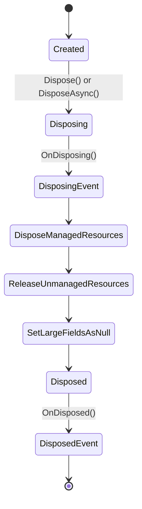
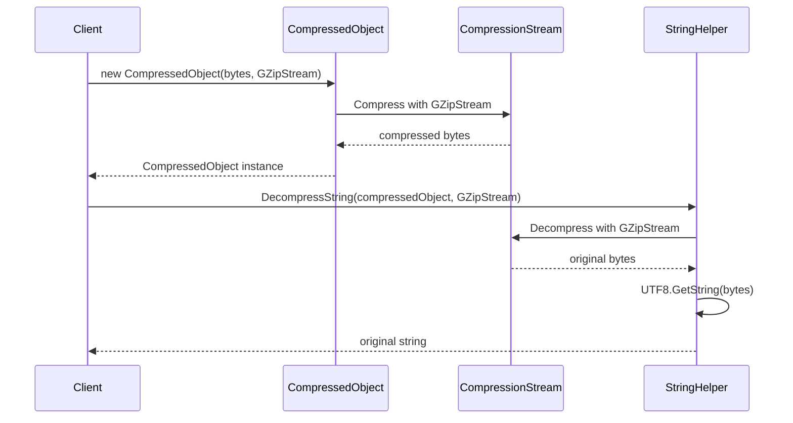

# Objects

## Contents
- [Overview](#overview)
- [Files](#files)
- [Types & Members](#types--members)
- [Diagrams](#diagrams)
- [Examples](#examples)
- [See Also](#see-also)

## Overview

Base object classes providing consistent patterns for disposal (sync/async), equality, immutability, observability, and compression. All object types follow best practices with proper resource cleanup and change tracking.

## Files

| File | Primary Type(s) | LOC | Responsibility |
|------|-----------------|-----|----------------|
| [DisposableObject.cs](../../../src/ThunderPropagator.BuildingBlocks.Application/Objects/DisposableObject.cs) | `DisposableObject` | 200 | Base class for IDisposable and IAsyncDisposable with events |
| [EquatableObject.cs](../../../src/ThunderPropagator.BuildingBlocks.Application/Objects/EquatableObject.cs) | `EquatableObject` | 80 | Base class for value equality |
| [ImmutableObject.cs](../../../src/ThunderPropagator.BuildingBlocks.Application/Objects/ImmutableObject.cs) | `ImmutableObject` | 60 | Base class for immutable objects |
| [NotifiableObject.cs](../../../src/ThunderPropagator.BuildingBlocks.Application/Objects/NotifiableObject.cs) | `NotifiableObject` | 90 | Base class with INotifyPropertyChanged |
| [CompressedObject.cs](../../../src/ThunderPropagator.BuildingBlocks.Application/Objects/CompressedObject.cs) | `CompressedObject` | 150 | Struct for compressed byte data with conversion |

## Types & Members

### Types Summary

| Type | Kind | Summary | Inherits/Implements | Key Members |
|------|------|---------|---------------------|-------------|
| `DisposableObject` | Abstract Class | Consistent disposal pattern (sync/async) | `EquatableObject`, `IDisposable`, `IAsyncDisposable` | `Dispose()`, `DisposeAsync()`, `DisposeManagedResources()`, Events |
| `EquatableObject` | Abstract Class | Value equality base class | - | `Equals()`, `GetHashCode()` |
| `ImmutableObject` | Abstract Class | Immutable object base | `EquatableObject` | Thread-safe, no mutating methods |
| `NotifiableObject` | Abstract Class | Observable property changes | `EquatableObject`, `INotifyPropertyChanged` | `PropertyChanged` event, `OnPropertyChanged()` |
| `CompressedObject` | Struct | Compressed byte data wrapper | - | Implicit conversions, `CompressionType` enum |

### DisposableObject

**Kind**: Abstract Class  
**Namespace**: `ThunderPropagator.BuildingBlocks.Application.Objects`

Base class providing consistent disposal pattern with both synchronous and asynchronous support, plus disposal events.

**Inherits**: `EquatableObject`  
**Implements**: `IDisposable`, `IAsyncDisposable`

**Key Properties**:
- `protected virtual bool IsDisposing { get; private set; }` — Currently disposing flag
- `protected virtual bool IsDisposed { get; private set; }` — Disposed flag

**Events**:
- `event EventHandler? Disposing` — Raised before disposal
- `event EventHandler? Disposed` — Raised after disposal

**Key Methods**:
- `void Dispose()` — Synchronous disposal
- `ValueTask DisposeAsync()` — Asynchronous disposal
- `protected virtual void DisposeManagedResources()` — Override to dispose managed resources
- `protected virtual void ReleaseUnmanagedResources()` — Override to free unmanaged resources
- `protected virtual void SetLargeFieldsAsNull()` — Override to null large fields
- `protected virtual ValueTask DisposeManagedResourcesAsync()` — Async managed disposal
- `protected virtual ValueTask ReleaseUnmanagedResourcesAsync()` — Async unmanaged disposal
- `protected virtual ValueTask SetLargeFieldsAsNullAsync()` — Async field nulling

**Static Factory Methods**:
- `static IDisposable Empty` — Singleton empty disposable
- `static IDisposable Create(Action disposeAction)` — Creates disposable from action
- `static IDisposable Create<TState>(TState state, Action<TState> disposeAction)` — Creates disposable with state

**Usage Recipe**:

```csharp
using ThunderPropagator.BuildingBlocks.Application.Objects;

public class DatabaseConnection : DisposableObject
{
    private SqlConnection? _connection;
    private SqlCommand? _command;
    
    public DatabaseConnection(string connectionString)
    {
        _connection = new SqlConnection(connectionString);
        _command = _connection.CreateCommand();
    }
    
    protected override void DisposeManagedResources()
    {
        _command?.Dispose();
        _connection?.Dispose();
    }
    
    protected override async ValueTask DisposeManagedResourcesAsync()
    {
        if (_command != null)
            await _command.DisposeAsync();
        if (_connection != null)
            await _connection.DisposeAsync();
    }
    
    protected override void SetLargeFieldsAsNull()
    {
        _command = null;
        _connection = null;
    }
}

// Usage
using var db = new DatabaseConnection("Server=localhost");
// Automatic disposal when out of scope

// Or async disposal
await using var db2 = new DatabaseConnection("Server=localhost");
// Async disposal when out of scope

// Anonymous disposable
var subscription = DisposableObject.Create(() =>
{
    Console.WriteLine("Disposing subscription");
});
```

[↑ Back to top](#contents)

## Diagrams

### DisposableObject Lifecycle



### Object Hierarchy

```mermaid
classDiagram
    class EquatableObject {
        <<abstract>>
        +Equals(other)
        +GetHashCode()
    }
    
    class DisposableObject {
        <<abstract>>
        +IsDisposing: bool
        +IsDisposed: bool
        +Dispose()
        +DisposeAsync()
        #DisposeManagedResources()
        #ReleaseUnmanagedResources()
        event Disposing
        event Disposed
    }
    
    class NotifiableObject {
        <<abstract>>
        event PropertyChanged
        #OnPropertyChanged(propertyName)
    }
    
    class ImmutableObject {
        <<abstract>>
        (thread-safe, no mutations)
    }
    
    EquatableObject <|-- DisposableObject
    EquatableObject <|-- NotifiableObject
    EquatableObject <|-- ImmutableObject
```

### CompressedObject Usage



[↑ Back to top](#contents)

## Examples

### Custom DisposableObject

```csharp
using ThunderPropagator.BuildingBlocks.Application.Objects;

public class FileLogger : DisposableObject
{
    private FileStream? _fileStream;
    private StreamWriter? _writer;
    
    public FileLogger(string filePath)
    {
        _fileStream = new FileStream(filePath, FileMode.Append, FileAccess.Write);
        _writer = new StreamWriter(_fileStream);
        
        Disposing += (sender, args) =>
        {
            Console.WriteLine("FileLogger disposing...");
        };
        
        Disposed += (sender, args) =>
        {
            Console.WriteLine("FileLogger disposed");
        };
    }
    
    public void Log(string message)
    {
        if (IsDisposed)
            throw new ObjectDisposedException(nameof(FileLogger));
        
        _writer?.WriteLine($"[{DateTime.UtcNow:O}] {message}");
        _writer?.Flush();
    }
    
    protected override void DisposeManagedResources()
    {
        _writer?.Dispose();
        _fileStream?.Dispose();
    }
    
    protected override async ValueTask DisposeManagedResourcesAsync()
    {
        if (_writer != null)
            await _writer.DisposeAsync();
        if (_fileStream != null)
            await _fileStream.DisposeAsync();
    }
    
    protected override void SetLargeFieldsAsNull()
    {
        _writer = null;
        _fileStream = null;
    }
}

// Usage
using var logger = new FileLogger("app.log");
logger.Log("Application started");
logger.Log("Processing request");
// Automatic disposal with events
```

### NotifiableObject in MVVM

```csharp
using ThunderPropagator.BuildingBlocks.Application.Objects;
using System.ComponentModel;

public class PersonViewModel : NotifiableObject
{
    private string _firstName = string.Empty;
    private string _lastName = string.Empty;
    private int _age;
    
    public string FirstName
    {
        get => _firstName;
        set
        {
            if (_firstName != value)
            {
                _firstName = value;
                OnPropertyChanged();
                OnPropertyChanged(nameof(FullName));
            }
        }
    }
    
    public string LastName
    {
        get => _lastName;
        set
        {
            if (_lastName != value)
            {
                _lastName = value;
                OnPropertyChanged();
                OnPropertyChanged(nameof(FullName));
            }
        }
    }
    
    public int Age
    {
        get => _age;
        set
        {
            if (_age != value)
            {
                _age = value;
                OnPropertyChanged();
            }
        }
    }
    
    public string FullName => $"{FirstName} {LastName}";
}

// Usage
var person = new PersonViewModel();
person.PropertyChanged += (sender, args) =>
{
    Console.WriteLine($"Property {args.PropertyName} changed");
};

person.FirstName = "John"; // Triggers PropertyChanged
person.LastName = "Doe";   // Triggers PropertyChanged (also FullName)
```

### Anonymous Disposable for Cleanup

```csharp
using ThunderPropagator.BuildingBlocks.Application.Objects;

public class ResourceTracker
{
    private static int _activeResources = 0;
    
    public static IDisposable Track(string resourceName)
    {
        Interlocked.Increment(ref _activeResources);
        Console.WriteLine($"Resource '{resourceName}' acquired. Active: {_activeResources}");
        
        return DisposableObject.Create(() =>
        {
            Interlocked.Decrement(ref _activeResources);
            Console.WriteLine($"Resource '{resourceName}' released. Active: {_activeResources}");
        });
    }
}

// Usage
using (ResourceTracker.Track("Database"))
using (ResourceTracker.Track("FileHandle"))
{
    // Do work
    Console.WriteLine("Working with resources");
}
// Automatic cleanup on scope exit
// Output:
// Resource 'Database' acquired. Active: 1
// Resource 'FileHandle' acquired. Active: 2
// Working with resources
// Resource 'FileHandle' released. Active: 1
// Resource 'Database' released. Active: 0
```

## See Also

- [Application Layer](../README.md)
- [FeederMessage](../README.md#feedermessage) — Inherits DisposableObject
- [ServiceConfiguration](../README.md#serviceconfiguration)
- [ChangeTrackingItems](../ChangeTrackingItems/README.md)
- [Documentation Home](../../README.md)

[↑ Back to top](#contents)
