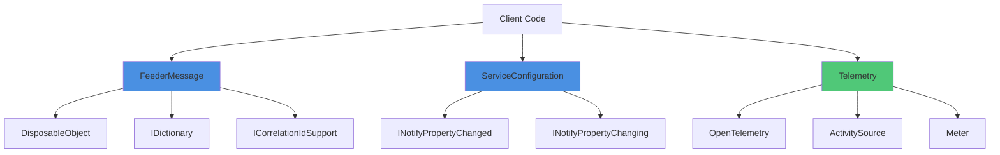
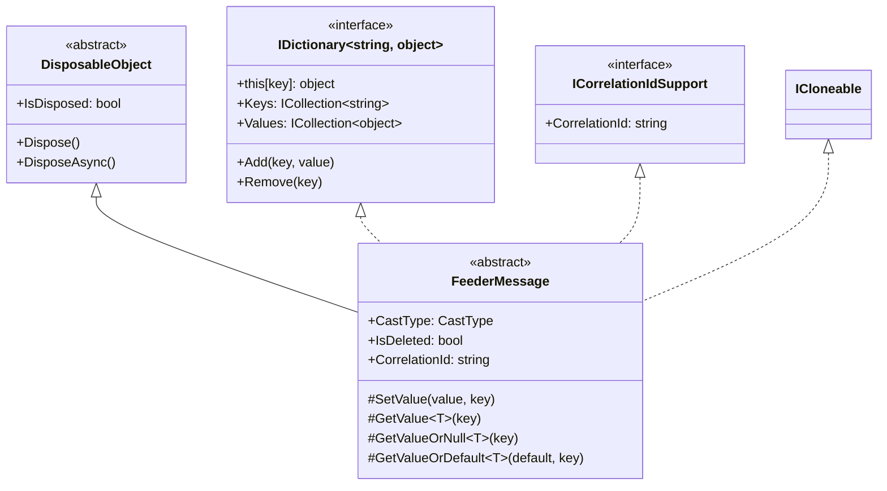
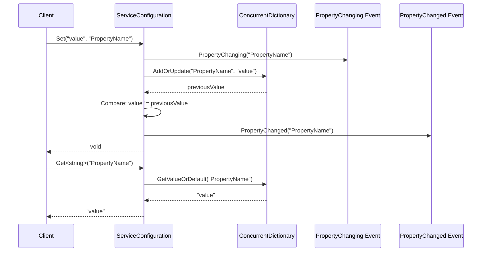
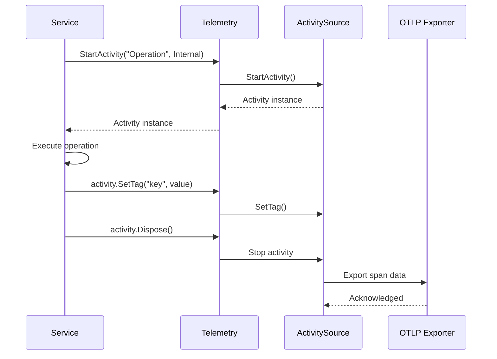

# BuildingBlocks.Application

## Contents
- [Overview](#overview)
- [Files](#files)
- [Types & Members](#types--members)
- [Diagrams](#diagrams)
- [ThunderPropagator Dependencies](#thunderpropagator-dependencies)
- [Examples](#examples)
- [See Also](#see-also)

## Overview

The Application layer provides core building blocks and abstractions for building distributed, cloud-native applications. This layer has **zero infrastructure dependencies** and includes essential patterns like FeederMessage (dictionary-based messages), ServiceConfiguration (strongly-typed configuration with change notifications), and DisposableObject (consistent resource cleanup). It also provides comprehensive serialization helpers, telemetry integration via OpenTelemetry, and specialized collections.

This layer targets .NET 8.0, 9.0, and 10.0 with multi-platform support (AnyCPU, x86, x64, ARM64).

## Files

| File | Primary Type(s) | LOC | Responsibility |
|------|-----------------|-----|----------------|
| [FeederMessage.cs](../../src/ThunderPropagator.BuildingBlocks.Application/FeederMessage.cs) | `FeederMessage` | 150 | Dictionary-based abstract message class with correlation ID support |
| [ServiceConfiguration.cs](../../src/ThunderPropagator.BuildingBlocks.Application/ServiceConfiguration.cs) | `ServiceConfiguration`, `IServiceConfiguration` | 173 | Strongly-typed configuration base with property change notifications |
| [Telemetry.cs](../../src/ThunderPropagator.BuildingBlocks.Application/Telemetry.cs) | `Telemetry` | 60 | OpenTelemetry integration for activities, counters, histograms |
| [DisposableObject.cs](../../src/ThunderPropagator.BuildingBlocks.Application/Objects/DisposableObject.cs) | `DisposableObject` | 200 | Base class for consistent resource disposal (sync/async) |
| [ExceptionInfo.cs](../../src/ThunderPropagator.BuildingBlocks.Application/ExceptionInfo.cs) | `ExceptionInfo` | 80 | Exception serialization wrapper |
| [ConcurrentStringBuilder.cs](../../src/ThunderPropagator.BuildingBlocks.Application/ConcurrentStringBuilder.cs) | `ConcurrentStringBuilder` | 100 | Thread-safe StringBuilder wrapper |
| [DispatcherTimer.cs](../../src/ThunderPropagator.BuildingBlocks.Application/DispatcherTimer.cs) | `DispatcherTimer` | 120 | Timer with dispatcher integration |
| [ICloneable.cs](../../src/ThunderPropagator.BuildingBlocks.Application/ICloneable.cs) | `ICloneable<T>` | 10 | Generic cloneable interface |
| [IConvertible.cs](../../src/ThunderPropagator.BuildingBlocks.Application/IConvertible.cs) | `IConvertible<T>` | 10 | Generic convertible interface |
| [InconvertibleException.cs](../../src/ThunderPropagator.BuildingBlocks.Application/InconvertibleException.cs) | `InconvertibleException` | 20 | Exception for conversion failures |
| [GlobalUsings.cs](../../src/ThunderPropagator.BuildingBlocks.Application/GlobalUsings.cs) | - | 15 | Global using directives |
| [AssemblyInfo.cs](../../src/ThunderPropagator.BuildingBlocks.Application/AssemblyInfo.cs) | - | 10 | Assembly metadata |

## Types & Members

### Types Summary

| Type | Kind | Summary | Inherits/Implements | Key Members |
|------|------|---------|---------------------|-------------|
| `FeederMessage` | Abstract Class | Dictionary-based message with correlation ID tracking | `DisposableObject`, `IDictionary<string, object?>`, `ICorrelationIdSupport`, `ICloneable` | `CastType`, `IsDeleted`, `CorrelationId`, `GetValue<T>()`, `SetValue()` |
| `ServiceConfiguration` | Abstract Class | Strongly-typed configuration with property change tracking | `IServiceConfiguration`, `INotifyPropertyChanged`, `INotifyPropertyChanging` | `Set<T>()`, `Get<T>()`, `Bind()` |
| `Telemetry` | Static Class | OpenTelemetry integration for activities and metrics | - | `StartActivity()`, `CreateCounter<T>()`, `CreateHistogram<T>()` |
| `ExceptionInfo` | Class | Exception serialization wrapper | - | `Message`, `StackTrace`, `InnerException`, Constructor(Exception) |
| `ConcurrentStringBuilder` | Class | Thread-safe StringBuilder | - | `Append()`, `AppendLine()`, `ToString()`, `Clear()` |
| `DispatcherTimer` | Class | Timer with dispatcher integration | - | `Start()`, `Stop()`, `Tick` event |
| `ICloneable<T>` | Interface | Generic cloneable contract | - | `T Clone()` |
| `IConvertible<T>` | Interface | Generic convertible contract | - | `T Convert()` |
| `InconvertibleException` | Class | Conversion failure exception | `Exception` | Constructor(string message) |

[↑ Back to top](#contents)

### FeederMessage

**Kind**: Abstract Class  
**Namespace**: `ThunderPropagator.BuildingBlocks.Application`

A dictionary-based message abstraction that stores properties in an internal `ConcurrentDictionary<string, object?>`. Ideal for building flexible message types where properties are dynamically accessed.

**Inherits/Implements**: `DisposableObject`, `IDictionary<string, object?>`, `IReadOnlyDictionary<string, object?>`, `ICorrelationIdSupport`, `ICloneable`, `ICloneable<IDictionary<string, object?>>`

**Attributes**: `[JsonSerialization(CamelCase = false)]`

**Key Properties**:
- `object? this[string key]` — Dictionary indexer for dynamic property access
- `CastType CastType` — Multicast or unicast message type (default: Multicast)
- `bool IsDeleted` — Soft-delete flag
- `string CorrelationId` — Correlation ID for distributed tracing
- `int? HashKey` — Internal hash key (nullable)

**Key Methods**:
- `void SetValue(object? value, [CallerMemberName] string? key = null)` — Sets a property value using caller member name
- `T GetValue<T>([CallerMemberName] string? key = null)` — Gets a property value or throws
- `T? GetValueOrNull<T>([CallerMemberName] string? key = null)` — Gets a property value or returns null
- `T GetValueOrDefault<T>(T @default, [CallerMemberName] string? key = null)` — Gets a property value or returns default
- `object Clone()` — Shallow clone (MemberwiseClone)
- `IDictionary<string, object?> Clone()` — Returns underlying dictionary

**Thread-safety**: Uses `ConcurrentDictionary` internally for thread-safe property storage.

**Usage Recipe**:

```csharp
using ThunderPropagator.BuildingBlocks.Application;

public class OrderMessage : FeederMessage
{
    public Guid OrderId
    {
        get => GetValueOrDefault(Guid.NewGuid());
        set => SetValue(value);
    }
    
    public decimal Amount
    {
        get => GetValueOrDefault(0m);
        set => SetValue(value);
    }
    
    public string? CustomerName
    {
        get => GetValueOrNull<string>();
        set => SetValue(value);
    }
}

// Usage
var order = new OrderMessage
{
    OrderId = Guid.NewGuid(),
    Amount = 99.99m,
    CustomerName = "John Doe",
    CorrelationId = "req-abc-123"
};

// Dynamic access
order["CustomField"] = "custom value";
var customValue = order.GetValueOrNull<string>("CustomField");
```

[↑ Back to top](#contents)

### ServiceConfiguration

**Kind**: Abstract Class  
**Namespace**: `ThunderPropagator.BuildingBlocks.Application`

Abstract base class for strongly-typed configuration with property change notifications. Properties are stored in a `ConcurrentDictionary<string, string>` and automatically tracked for changes.

**Inherits/Implements**: `IServiceConfiguration`, `INotifyPropertyChanged`, `INotifyPropertyChanging`, `IEquatable<ServiceConfiguration>`

**Attributes**: `[JsonConverter(typeof(ServiceConfigurationJsonConverter))]`

**Key Properties**:
- `event PropertyChangingEventHandler? PropertyChanging` — Raised before property value changes
- `event PropertyChangedEventHandler? PropertyChanged` — Raised after property value changes

**Key Methods**:
- `void Set<T>(T? value, [CallerMemberName] string? key = null)` — Sets a property value with change notification
- `T? Get<T>([CallerMemberName] string? key = null)` — Gets a property value or default
- `T Get<T>(T defaultValue, [CallerMemberName] string? key = null)` — Gets a property value or specified default
- `void Bind(IEnumerable<KeyValuePair<string, string>> properties)` — Binds from key-value pairs
- `void Bind(ServiceConfiguration serviceConfiguration)` — Binds from another configuration

**Constructors**:
- `protected ServiceConfiguration()` — Default constructor
- `protected ServiceConfiguration(IEnumerable<KeyValuePair<string, string>> properties)` — Initialize with properties
- `protected ServiceConfiguration(ServiceConfiguration serviceConfiguration)` — Copy constructor

**Serialization**: Custom JSON converter with `CaseConverter` for camelCase serialization.

**Usage Recipe**:

```csharp
using ThunderPropagator.BuildingBlocks.Application;

public class DatabaseConfiguration : ServiceConfiguration
{
    public string ConnectionString
    {
        get => Get<string>() ?? string.Empty;
        set => Set(value);
    }
    
    public int MaxPoolSize
    {
        get => Get(100); // default: 100
        set => Set(value);
    }
    
    public TimeSpan CommandTimeout
    {
        get => Get(TimeSpan.FromSeconds(30));
        set => Set(value);
    }
}

// Usage
var config = new DatabaseConfiguration();
config.PropertyChanged += (sender, e) =>
{
    Console.WriteLine($"Property {e.PropertyName} changed");
};

config.ConnectionString = "Server=localhost;Database=mydb";
config.MaxPoolSize = 200;

// Serialize to JSON (camelCase)
var json = config.ToNJson(); // uses Newtonsoft.Json
```

[↑ Back to top](#contents)

### Telemetry

**Kind**: Static Class  
**Namespace**: `ThunderPropagator.BuildingBlocks.Application`

Provides OpenTelemetry integration for distributed tracing (activities) and metrics (counters, histograms, gauges). Controlled by environment variables `OTEL_EXPORTER_OTLP_ENDPOINT` (activities) and `METER_ENABLED` (metrics).

**Constants**:
- `string MeterName = "thunderPropagator.meter"` — Default meter name
- `string ActivityName = "thunderPropagator.activity"` — Default activity source name
- `string Version = "1.0.0"` — Telemetry version
- `KeyValuePair<string, object?> SuccessfulTag` — Success status tag
- `KeyValuePair<string, object?> UnsuccessfulTag` — Failed status tag

**Key Methods**:
- `Activity? StartActivity(string name, ActivityKind kind)` — Starts a new activity span
- `Activity? StartActivity(string name, ActivityKind kind, ActivityContext parentContext)` — Starts activity with parent context
- `Counter<T>? CreateCounter<T>(string name, string? unit, string? description)` — Creates a counter metric
- `UpDownCounter<T>? CreateUpDownCounter<T>(string name, string? unit, string? description)` — Creates an up/down counter
- `Histogram<T>? CreateHistogram<T>(string name, string? unit, string? description)` — Creates a histogram metric
- `ObservableGauge<T>? CreateObservableGauge<T>(string name, Func<T> observeValue, string? unit, string? description)` — Creates an observable gauge

**Environment Variables**:
- `OTEL_EXPORTER_OTLP_ENDPOINT` — OTLP exporter endpoint (enables activities)
- `ACTIVITY_NAME` — Custom activity source name
- `VERSION` — Custom version
- `METER_ENABLED` — Enable/disable meters (default: true)
- `METER_NAME` — Custom meter name

**Usage Recipe**:

```csharp
using ThunderPropagator.BuildingBlocks.Application;

public class OrderService
{
    public async Task ProcessOrderAsync(Order order)
    {
        const string activityName = $"{nameof(OrderService)}_{nameof(ProcessOrderAsync)}";
        using var activity = Telemetry.HasListeners() ? Telemetry.StartActivity(activityName, ActivityKind.Internal) : null;
        
        activity?.SetTag("order.id", order.Id);
        activity?.SetTag("order.amount", order.Amount);
        
        try
        {
            // Process order logic
            await SaveOrderAsync(order);
            
            activity?.SetTag("status", "success");
            activity?.AddTag(Telemetry.SuccessfulTag);
        }
        catch (Exception ex)
        {
            activity?.SetTag("error", ex.Message);
            activity?.AddTag(Telemetry.UnsuccessfulTag);
            throw;
        }
    }
}

// Metrics
var orderCounter = Telemetry.CreateCounter<long>("orders.processed", "orders", "Number of orders processed");
orderCounter?.Add(1, new KeyValuePair<string, object?>("status", "success"));

var orderHistogram = Telemetry.CreateHistogram<double>("order.amount", "USD", "Order amount distribution");
orderHistogram?.Record(99.99, new KeyValuePair<string, object?>("currency", "USD"));
```

[↑ Back to top](#contents)

## Diagrams

### Application Layer Architecture



### FeederMessage Class Hierarchy



### ServiceConfiguration Sequence



### Telemetry Activity Flow



[↑ Back to top](#contents)

## ThunderPropagator Dependencies

| Package | Version | Description | Links |
|---------|---------|-------------|-------|
| Ardalis.GuardClauses | 5.0.0 | Guard clause extensions for parameter validation | [NuGet](https://nuget.pkg.github.com/KiarashMinoo/index.json) |
| JetBrains.Annotations | 2025.2.4 | JetBrains code analysis annotations | [NuGet](https://nuget.pkg.github.com/KiarashMinoo/index.json) |
| CaseConverter | 2.0.1 | Case conversion utilities (camelCase, PascalCase) | [NuGet](https://nuget.pkg.github.com/KiarashMinoo/index.json) |
| Newtonsoft.Json | 13.0.4 | JSON serialization (ServiceConfiguration) | [NuGet](https://nuget.pkg.github.com/KiarashMinoo/index.json) |
| System.Diagnostics.DiagnosticSource | Built-in | OpenTelemetry integration | [Microsoft](https://www.nuget.org/packages/System.Diagnostics.DiagnosticSource/) |

## Examples

### Creating Custom FeederMessage

```csharp
using ThunderPropagator.BuildingBlocks.Application;
using ThunderPropagator.BuildingBlocks.Application.Enums;

public class EventMessage : FeederMessage
{
    public Guid EventId
    {
        get => GetValueOrDefault(Guid.NewGuid());
        set => SetValue(value);
    }
    
    public DateTime Timestamp
    {
        get => GetValueOrDefault(DateTime.UtcNow);
        set => SetValue(value);
    }
    
    public string EventType
    {
        get => GetValueOrNull<string>() ?? "Unknown";
        set => SetValue(value);
    }
    
    public Dictionary<string, object>? Metadata
    {
        get => GetValueOrNull<Dictionary<string, object>>();
        set => SetValue(value);
    }
}

// Usage
var evt = new EventMessage
{
    EventId = Guid.NewGuid(),
    EventType = "UserRegistered",
    Timestamp = DateTime.UtcNow,
    CorrelationId = "trace-xyz-789",
    CastType = CastType.Unicast,
    Metadata = new Dictionary<string, object>
    {
        ["UserId"] = 12345,
        ["Source"] = "WebAPI"
    }
};

// Serialize to JSON
var json = evt.ToJson();
Console.WriteLine(json);
```

### Custom ServiceConfiguration with Validation

```csharp
using ThunderPropagator.BuildingBlocks.Application;
using Ardalis.GuardClauses;

public class ApiConfiguration : ServiceConfiguration
{
    public string BaseUrl
    {
        get => Get<string>() ?? "https://localhost";
        set
        {
            Guard.Against.NullOrWhiteSpace(value, nameof(BaseUrl));
            Guard.Against.InvalidFormat(value, nameof(BaseUrl), @"^https?://", 
                "BaseUrl must start with http:// or https://");
            Set(value);
        }
    }
    
    public int Timeout
    {
        get => Get(30);
        set
        {
            Guard.Against.NegativeOrZero(value, nameof(Timeout));
            Set(value);
        }
    }
    
    public string? ApiKey
    {
        get => Get<string>();
        set => Set(value);
    }
}

// Usage
var config = new ApiConfiguration
{
    BaseUrl = "https://api.example.com",
    Timeout = 60,
    ApiKey = "secret-key-123"
};

// Track changes
config.PropertyChanged += (sender, args) =>
{
    Console.WriteLine($"Configuration changed: {args.PropertyName}");
};

config.Timeout = 120; // Triggers PropertyChanged event
```

## See Also

- [Attributes](./Attributes/README.md) — JSON serialization control attributes
- [Certificate](./Certificate/README.md) — X.509 certificate utilities
- [ChangeTrackingItems](./ChangeTrackingItems/README.md) — Property change tracking
- [Ciphering](./Ciphering/README.md) — Encryption services
- [Collections](./Collections/README.md) — Specialized collections
- [CorrelationId](./CorrelationId/README.md) — Correlation ID management
- [Enums](./Enums/README.md) — Common enumerations
- [Helpers](./Helpers/README.md) — Utility helpers
- [Identity](./Identity/README.md) — JWT identity helpers
- [Objects](./Objects/README.md) — Base object classes
- [Serializations](./Serializations/README.md) — Serialization abstractions
- [Infrastructure Layer](../BuildingBlocks.Infrastructure/README.md)
- [Documentation Home](../README.md)

[↑ Back to top](#contents)
