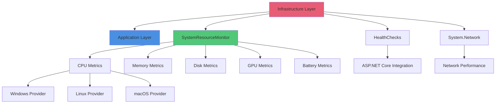

# BuildingBlocks.Infrastructure

## Contents
- [Overview](#overview)
- [Files](#files)
- [Types & Members](#types--members)
- [Diagrams](#diagrams)
- [ThunderPropagator Dependencies](#thunderpropagator-dependencies)
- [Examples](#examples)
- [See Also](#see-also)

## Overview

The Infrastructure layer provides system-level components including cross-platform system resource monitoring, ASP.NET Core health checks, and network performance tracking. This layer depends on the Application layer but provides NO dependencies back to Application. All components use platform-specific providers with graceful degradation when metrics are unavailable.

Targets .NET 8.0, 9.0, and 10.0 with multi-platform support (Windows, Linux, macOS on AnyCPU, x86, x64, ARM64).

## Files

| File | Primary Type(s) | LOC | Responsibility |
|------|-----------------|-----|----------------|
| [AssemblyInfo.cs](../../src/ThunderPropagator.BuildingBlocks.Infrastructure/AssemblyInfo.cs) | - | 10 | Assembly metadata and version information |

## Types & Members

### Types Summary

| Type | Kind | Summary | Inherits/Implements | Key Members |
|------|------|---------|---------------------|-------------|
| N/A | - | No public types in root | - | See child folders |

## Diagrams

### Infrastructure Layer Architecture



### Dependency Flow


## ThunderPropagator Dependencies

| Package | Version | Description | Links |
|---------|---------|-------------|-------|
| ThunderPropagator.BuildingBlocks.Application | 1.0.1-beta.* | Core application building blocks | [GitHub Packages](https://nuget.pkg.github.com/KiarashMinoo/index.json) |
| Microsoft.Extensions.Diagnostics.HealthChecks | 8.*\|9.*\|10.* | ASP.NET Core health check support | [NuGet](https://www.nuget.org/packages/Microsoft.Extensions.Diagnostics.HealthChecks) |

## Examples

### Registering System Resource Monitoring

```csharp
using Microsoft.Extensions.DependencyInjection;
using ThunderPropagator.BuildingBlocks.Infrastructure.SystemResourceMonitor;

var services = new ServiceCollection();

services.AddSystemResourceMonitor(options =>
{
    options.EnableCpuMetrics = true;
    options.EnableCpuTemperature = true;
    options.EnableMemoryMetrics = true;
    options.EnableDiskHealthMetrics = true;
    options.EnableDiskSpeedMetrics = true;
    options.EnableGpuMetrics = true;
    options.EnableBatteryMetrics = true;
    options.DefaultSamplingWindowMs = 500;
    options.CollectAllProcesses = false; // Current process only
});

var serviceProvider = services.BuildServiceProvider();
var monitor = serviceProvider.GetRequiredService<ISystemResourceMonitor>();

// Collect metrics
var metrics = await monitor.GetMetricsAsync();
Console.WriteLine($"CPU Usage: {metrics.Cpu.CurrentProcessUsage:F2}%");
Console.WriteLine($"Memory Used: {metrics.Memory.UsedMemory / (1024 * 1024 * 1024):F2} GB");
```

### Platform Detection

The infrastructure layer automatically detects the platform and uses the appropriate provider:

```csharp
// Internal implementation example (not exposed to clients)
internal static ICpuTemperatureProvider CreatePlatformProvider()
{
    if (RuntimeInformation.IsOSPlatform(OSPlatform.Windows))
        return new WindowsCpuTemperatureProvider();
    if (RuntimeInformation.IsOSPlatform(OSPlatform.Linux))
        return new LinuxCpuTemperatureProvider();
    if (RuntimeInformation.IsOSPlatform(OSPlatform.OSX))
        return new MacOsCpuTemperatureProvider();
    
    return new NullCpuTemperatureProvider(); // Graceful degradation
}
```

## See Also

- [SystemResourceMonitor](./SystemResourceMonitor/README.md) — Cross-platform resource monitoring
- [HealthChecks](./HealthChecks/README.md) — ASP.NET Core health check integrations
- [System](./System/README.md) — System-level utilities
- [System/Network](./System/Network/README.md) — Network performance monitoring
- [Application Layer](../BuildingBlocks.Application/README.md)
- [Documentation Home](../README.md)

[↑ Back to top](#contents)
