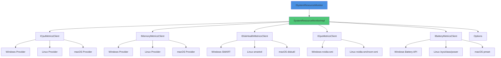
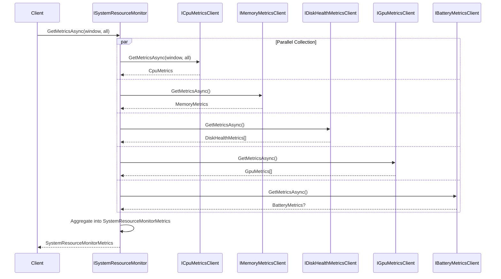
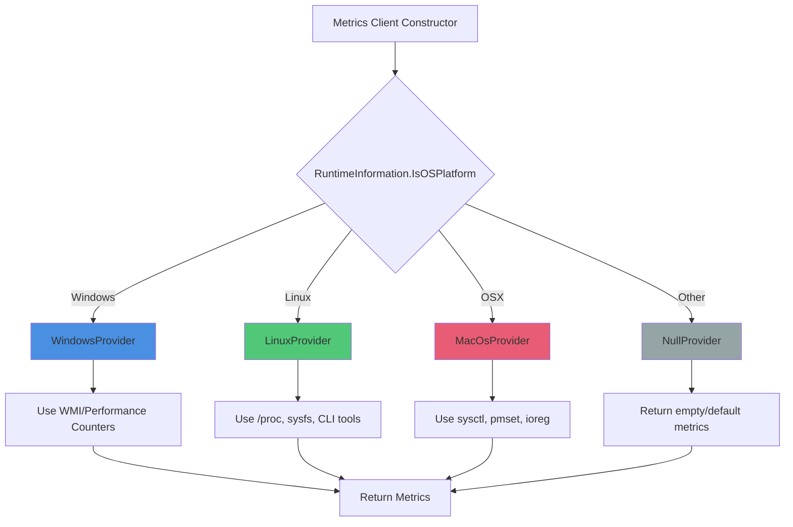
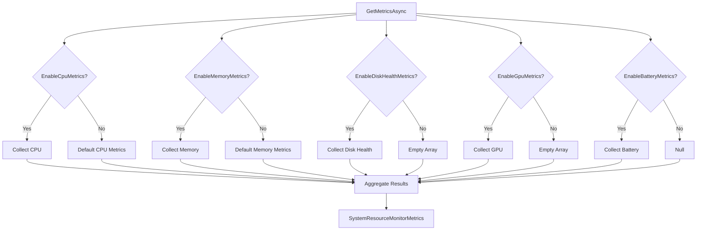

# SystemResourceMonitor

## Contents
- [Overview](#overview)
- [Files](#files)
- [Types & Members](#types--members)
- [Diagrams](#diagrams)
- [ThunderPropagator Dependencies](#thunderpropagator-dependencies)
- [Examples](#examples)
- [See Also](#see-also)

## Overview

SystemResourceMonitor provides comprehensive, cross-platform system resource monitoring including CPU usage/temperature, memory, disk health (SMART), disk I/O performance, GPU metrics, and battery status. Uses platform-specific providers (Windows/Linux/macOS) with graceful degradation and NO external platform-specific packages — relies solely on .NET BCL and CLI tools.

Metrics are collected asynchronously with configurable sampling windows and process scopes (current process or all processes).

## Files

| File | Primary Type(s) | LOC | Responsibility |
|------|-----------------|-----|----------------|
| [ISystemResourceMonitor.cs](../../../src/ThunderPropagator.BuildingBlocks.Infrastructure/SystemResourceMonitor/ISystemResourceMonitor.cs) | `ISystemResourceMonitor`, `SystemResourceMonitorImpl` | 120 | Main interface and implementation for resource monitoring |
| [SystemResourceMonitorMetrics.cs](../../../src/ThunderPropagator.BuildingBlocks.Infrastructure/SystemResourceMonitor/SystemResourceMonitorMetrics.cs) | `SystemResourceMonitorMetrics` | 50 | Aggregate metrics record containing all resource data |
| [SystemResourceMonitorOptions.cs](../../../src/ThunderPropagator.BuildingBlocks.Infrastructure/SystemResourceMonitor/SystemResourceMonitorOptions.cs) | `SystemResourceMonitorOptions` | 85 | Configuration options for enabling/disabling metrics |
| [SystemResourceMonitorExtensions.cs](../../../src/ThunderPropagator.BuildingBlocks.Infrastructure/SystemResourceMonitor/SystemResourceMonitorExtensions.cs) | `SystemResourceMonitorExtensions` | 150 | DI registration extensions |

## Types & Members

### Types Summary

| Type | Kind | Summary | Inherits/Implements | Key Members |
|------|------|---------|---------------------|-------------|
| `ISystemResourceMonitor` | Interface | Main interface for system resource monitoring | `IMetricsClient<SystemResourceMonitorMetrics>` | `GetMetricsAsync()`, `GetMetrics()` |
| `SystemResourceMonitorMetrics` | Record | Aggregate metrics container | `IMetrics` | `Cpu`, `CpuTemperature`, `Memory`, `Drives`, `DiskHealth`, `DiskSpeed`, `Gpus`, `Battery` |
| `SystemResourceMonitorOptions` | Sealed Class | Configuration options | - | Enable flags, `DefaultSamplingWindowMs`, `CollectAllProcesses` |
| `SystemResourceMonitorExtensions` | Static Class | DI registration | - | `AddSystemResourceMonitor()` |

[↑ Back to top](#contents)

### ISystemResourceMonitor

**Kind**: Interface  
**Namespace**: `ThunderPropagator.BuildingBlocks.Infrastructure.SystemResourceMonitor`

Main interface for collecting comprehensive system resource metrics. Provides async and sync methods with configurable sampling windows and process scopes.

**Inherits**: `IMetricsClient<SystemResourceMonitorMetrics>`

**Key Methods**:
- `Task<SystemResourceMonitorMetrics> GetMetricsAsync(long? window = null, bool? all = null, CancellationToken cancellationToken = default)` — Collects metrics asynchronously
  - `window`: Sampling window in milliseconds for CPU usage calculation (default: from options)
  - `all`: Whether to collect all processes or just current process (default: from options)
  - Returns: Comprehensive metrics including CPU, memory, disk, GPU, battery
- `SystemResourceMonitorMetrics GetMetrics(long? window = null, bool? all = null)` — Synchronous wrapper (back-compat)

**XML Docs**:
- `<summary>Interface for system resource monitoring with comprehensive hardware health and performance metrics.</summary>`
- `<param name="window">Sampling window in milliseconds for CPU usage calculation. If null, uses default from options.</param>`
- `<param name="all">Whether to collect metrics for all processes or just current process.</param>`

**Usage Recipe**:

```csharp
using ThunderPropagator.BuildingBlocks.Infrastructure.SystemResourceMonitor;
using Microsoft.Extensions.DependencyInjection;

// Register in DI
services.AddSystemResourceMonitor(options =>
{
    options.EnableCpuMetrics = true;
    options.EnableMemoryMetrics = true;
    options.EnableDiskHealthMetrics = true;
    options.DefaultSamplingWindowMs = 500;
});

// Inject and use
public class MonitoringService
{
    private readonly ISystemResourceMonitor _monitor;
    
    public MonitoringService(ISystemResourceMonitor monitor)
    {
        _monitor = monitor;
    }
    
    public async Task<SystemResourceMonitorMetrics> GetSystemStatusAsync()
    {
        // Use default options
        return await _monitor.GetMetricsAsync();
    }
    
    public async Task<SystemResourceMonitorMetrics> GetDetailedMetricsAsync()
    {
        // Override: 1 second sampling window, all processes
        return await _monitor.GetMetricsAsync(window: 1000, all: true);
    }
}
```

[↑ Back to top](#contents)

### SystemResourceMonitorMetrics

**Kind**: Record  
**Namespace**: `ThunderPropagator.BuildingBlocks.Infrastructure.SystemResourceMonitor`

Aggregate container for all system resource metrics. Immutable record with init-only properties.

**Implements**: `IMetrics`

**Key Properties**:
- `CpuMetrics Cpu { get; init; }` — CPU usage and process metrics (required)
- `CpuTemperatureMetrics? CpuTemperature { get; init; }` — CPU temperature (nullable, may not be supported)
- `MemoryMetrics Memory { get; init; }` — Memory usage metrics (required)
- `SystemDriveMetrics[] Drives { get; init; }` — System drive space metrics (empty array if disabled)
- `DiskHealthMetrics[] DiskHealth { get; init; }` — Disk health SMART status (empty array if disabled)
- `DiskSpeedMetrics[] DiskSpeed { get; init; }` — Disk I/O performance (empty array if disabled)
- `GpuMetrics[] Gpus { get; init; }` — GPU metrics (empty array if disabled/not present)
- `BatteryMetrics? Battery { get; init; }` — Battery status (nullable, only populated if battery present)

**XML Docs**:
- `<summary>Comprehensive system resource monitoring metrics including hardware health and performance data.</summary>`
- Each property has XML summary explaining its content

**Usage Recipe**:

```csharp
var metrics = await monitor.GetMetricsAsync();

// CPU
Console.WriteLine($"CPU Cores: {metrics.Cpu.LogicalProcessors}");
Console.WriteLine($"Current Process CPU: {metrics.Cpu.CurrentProcessUsage:F2}%");
Console.WriteLine($"System CPU: {metrics.Cpu.TotalUsage:F2}%");

// Memory
Console.WriteLine($"Total Memory: {metrics.Memory.TotalMemory / (1024 * 1024 * 1024):F2} GB");
Console.WriteLine($"Used Memory: {metrics.Memory.UsedMemory / (1024 * 1024 * 1024):F2} GB");

// CPU Temperature (if available)
if (metrics.CpuTemperature != null)
{
    Console.WriteLine($"CPU Temp: {metrics.CpuTemperature.AverageCelsius:F1}°C");
}

// Disks
foreach (var drive in metrics.Drives)
{
    Console.WriteLine($"Drive {drive.Name}: {drive.FreeSpace / (1024 * 1024 * 1024):F2} GB free");
}

// Disk Health (SMART)
foreach (var disk in metrics.DiskHealth)
{
    Console.WriteLine($"Disk {disk.DeviceName}: {disk.HealthStatus}");
}

// GPUs
foreach (var gpu in metrics.Gpus)
{
    Console.WriteLine($"GPU {gpu.Name}: {gpu.UtilizationPercent}% util, {gpu.TemperatureCelsius}°C");
}

// Battery (if present)
if (metrics.Battery != null)
{
    Console.WriteLine($"Battery: {metrics.Battery.ChargePercent}%, {metrics.Battery.Status}");
}
```

[↑ Back to top](#contents)

### SystemResourceMonitorOptions

**Kind**: Sealed Class  
**Namespace**: `ThunderPropagator.BuildingBlocks.Infrastructure.SystemResourceMonitor`

Configuration options for enabling/disabling individual metric categories and setting defaults.

**Key Properties**:
- `bool EnableCpuMetrics { get; set; } = true` — Enable CPU usage metrics
- `bool EnableCpuTemperature { get; set; } = true` — Enable CPU temperature metrics
- `bool EnableMemoryMetrics { get; set; } = true` — Enable memory metrics
- `bool EnableDiskSpaceMetrics { get; set; } = true` — Enable disk space metrics
- `bool EnableDiskHealthMetrics { get; set; } = true` — Enable SMART disk health
- `bool EnableDiskSpeedMetrics { get; set; } = true` — Enable disk I/O performance
- `bool EnableGpuMetrics { get; set; } = true` — Enable GPU metrics
- `bool EnableBatteryMetrics { get; set; } = true` — Enable battery metrics
- `long DefaultSamplingWindowMs { get; set; } = 500` — Default CPU sampling window (milliseconds)
- `bool CollectAllProcesses { get; set; } = false` — Collect all processes or current only
- `int MaxGpuProcesses { get; set; } = 10` — Max GPU processes to track per GPU
- `int HardwareMetricsCacheDurationSeconds { get; set; } = 60` — Cache duration for hardware info

**XML Docs**:
- Each property has XML summary with description and default value

**Usage Recipe**:

```csharp
using ThunderPropagator.BuildingBlocks.Infrastructure.SystemResourceMonitor;

services.AddSystemResourceMonitor(options =>
{
    // Minimal configuration (CPU and memory only)
    options.EnableCpuMetrics = true;
    options.EnableCpuTemperature = false;
    options.EnableMemoryMetrics = true;
    options.EnableDiskHealthMetrics = false;
    options.EnableDiskSpeedMetrics = false;
    options.EnableGpuMetrics = false;
    options.EnableBatteryMetrics = false;
    
    // Fast sampling for real-time monitoring
    options.DefaultSamplingWindowMs = 250;
    
    // Current process only (lower overhead)
    options.CollectAllProcesses = false;
});

// Or full configuration
services.AddSystemResourceMonitor(options =>
{
    // Enable everything
    options.EnableCpuMetrics = true;
    options.EnableCpuTemperature = true;
    options.EnableMemoryMetrics = true;
    options.EnableDiskHealthMetrics = true;
    options.EnableDiskSpeedMetrics = true;
    options.EnableGpuMetrics = true;
    options.EnableBatteryMetrics = true;
    
    // Longer sampling window (more stable readings)
    options.DefaultSamplingWindowMs = 1000;
    
    // All processes (for system monitoring dashboard)
    options.CollectAllProcesses = true;
    
    // Track more GPU processes
    options.MaxGpuProcesses = 20;
    
    // Cache hardware metrics longer
    options.HardwareMetricsCacheDurationSeconds = 120;
});
```

[↑ Back to top](#contents)

### SystemResourceMonitorExtensions

**Kind**: Static Class  
**Namespace**: `ThunderPropagator.BuildingBlocks.Infrastructure.SystemResourceMonitor`

Provides DI registration extension methods for SystemResourceMonitor.

**Key Methods**:
- `IServiceCollection AddSystemResourceMonitor(this IServiceCollection services, Action<SystemResourceMonitorOptions>? configure = null)` — Registers all metrics clients and options

**Registrations**:
- `IOptions<SystemResourceMonitorOptions>` → `SystemResourceMonitorOptions`
- `ICpuMetricsClient` → `CpuMetricsClient` (Singleton)
- `ICpuTemperatureMetricsClient` → `CpuTemperatureMetricsClient` (Singleton)
- `IMemoryMetricsClient` → `MemoryMetricsClient` (Singleton)
- `ISystemDriveMetricsClient` → `SystemDriveMetricsClient` (Singleton)
- `IDiskHealthMetricsClient` → `DiskHealthMetricsClient` (Singleton)
- `IDiskSpeedMetricsClient` → `DiskSpeedMetricsClient` (Singleton)
- `IGpuMetricsClient` → `GpuMetricsClient` (Singleton)
- `IBatteryMetricsClient` → `BatteryMetricsClient` (Singleton)
- `ISystemResourceMonitor` → `SystemResourceMonitorImpl` (Singleton)

**Usage Recipe**:

```csharp
using Microsoft.Extensions.DependencyInjection;
using ThunderPropagator.BuildingBlocks.Infrastructure.SystemResourceMonitor;

var services = new ServiceCollection();

// Simple registration (all defaults)
services.AddSystemResourceMonitor();

// With configuration
services.AddSystemResourceMonitor(options =>
{
    options.EnableCpuMetrics = true;
    options.DefaultSamplingWindowMs = 500;
});

// Build and use
var serviceProvider = services.BuildServiceProvider();
var monitor = serviceProvider.GetRequiredService<ISystemResourceMonitor>();
```

[↑ Back to top](#contents)

## Diagrams

### System Resource Monitor Architecture



### Metrics Collection Sequence



### Platform Provider Selection



### Options-Driven Conditional Collection



[↑ Back to top](#contents)

## ThunderPropagator Dependencies

| Package | Version | Description | Links |
|---------|---------|-------------|-------|
| ThunderPropagator.BuildingBlocks.Application | 1.0.1-beta.* | Core building blocks (Telemetry, DisposableObject) | [GitHub Packages](https://nuget.pkg.github.com/KiarashMinoo/index.json) |
| Microsoft.Extensions.DependencyInjection | Built-in | DI container abstractions | [Microsoft](https://www.nuget.org/packages/Microsoft.Extensions.DependencyInjection/) |
| Microsoft.Extensions.Options | Built-in | Options pattern support | [Microsoft](https://www.nuget.org/packages/Microsoft.Extensions.Options/) |

## Examples

### Basic Usage in ASP.NET Core

```csharp
using Microsoft.AspNetCore.Builder;
using Microsoft.Extensions.DependencyInjection;
using ThunderPropagator.BuildingBlocks.Infrastructure.SystemResourceMonitor;

var builder = WebApplication.CreateBuilder(args);

// Register system resource monitoring
builder.Services.AddSystemResourceMonitor(options =>
{
    options.EnableCpuMetrics = true;
    options.EnableMemoryMetrics = true;
    options.EnableDiskHealthMetrics = true;
    options.EnableGpuMetrics = true;
    options.DefaultSamplingWindowMs = 1000;
});

var app = builder.Build();

// Endpoint to expose metrics
app.MapGet("/metrics", async (ISystemResourceMonitor monitor) =>
{
    var metrics = await monitor.GetMetricsAsync();
    return Results.Json(metrics);
});

app.Run();
```

### Background Monitoring Service

```csharp
using Microsoft.Extensions.Hosting;
using ThunderPropagator.BuildingBlocks.Infrastructure.SystemResourceMonitor;

public class SystemMonitoringService : BackgroundService
{
    private readonly ISystemResourceMonitor _monitor;
    private readonly ILogger<SystemMonitoringService> _logger;
    
    public SystemMonitoringService(
        ISystemResourceMonitor monitor,
        ILogger<SystemMonitoringService> logger)
    {
        _monitor = monitor;
        _logger = logger;
    }
    
    protected override async Task ExecuteAsync(CancellationToken stoppingToken)
    {
        while (!stoppingToken.IsCancellationRequested)
        {
            try
            {
                var metrics = await _monitor.GetMetricsAsync(cancellationToken: stoppingToken);
                
                // Log critical metrics
                _logger.LogInformation(
                    "CPU: {CpuUsage:F2}%, Memory: {MemoryUsed:F2} GB / {MemoryTotal:F2} GB",
                    metrics.Cpu.CurrentProcessUsage,
                    metrics.Memory.UsedMemory / (1024.0 * 1024.0 * 1024.0),
                    metrics.Memory.TotalMemory / (1024.0 * 1024.0 * 1024.0));
                
                // Check disk health
                foreach (var disk in metrics.DiskHealth)
                {
                    if (disk.HealthStatus != DiskHealthStatus.Healthy)
                    {
                        _logger.LogWarning(
                            "Disk {DeviceName} health: {Status}",
                            disk.DeviceName,
                            disk.HealthStatus);
                    }
                }
                
                // Check GPU temperature
                foreach (var gpu in metrics.Gpus)
                {
                    if (gpu.TemperatureCelsius > 85)
                    {
                        _logger.LogWarning(
                            "GPU {Name} temperature high: {Temp}°C",
                            gpu.Name,
                            gpu.TemperatureCelsius);
                    }
                }
            }
            catch (Exception ex)
            {
                _logger.LogError(ex, "Error collecting system metrics");
            }
            
            // Wait 10 seconds before next collection
            await Task.Delay(TimeSpan.FromSeconds(10), stoppingToken);
        }
    }
}

// Register in DI
services.AddSystemResourceMonitor();
services.AddHostedService<SystemMonitoringService>();
```

### Custom Metrics Dashboard

```csharp
using ThunderPropagator.BuildingBlocks.Infrastructure.SystemResourceMonitor;

public class MetricsDashboard
{
    private readonly ISystemResourceMonitor _monitor;
    
    public MetricsDashboard(ISystemResourceMonitor monitor)
    {
        _monitor = monitor;
    }
    
    public async Task<DashboardData> GetDashboardDataAsync()
    {
        // Collect metrics with 2-second sampling window for accuracy
        var metrics = await _monitor.GetMetricsAsync(window: 2000, all: true);
        
        return new DashboardData
        {
            Timestamp = DateTime.UtcNow,
            
            // CPU Summary
            CpuCores = metrics.Cpu.LogicalProcessors,
            CpuUsagePercent = metrics.Cpu.TotalUsage,
            ProcessCpuUsagePercent = metrics.Cpu.CurrentProcessUsage,
            CpuTemperature = metrics.CpuTemperature?.AverageCelsius,
            
            // Memory Summary
            TotalMemoryGB = metrics.Memory.TotalMemory / (1024.0 * 1024.0 * 1024.0),
            UsedMemoryGB = metrics.Memory.UsedMemory / (1024.0 * 1024.0 * 1024.0),
            MemoryUsagePercent = (metrics.Memory.UsedMemory * 100.0) / metrics.Memory.TotalMemory,
            
            // Disk Summary
            Drives = metrics.Drives.Select(d => new DriveInfo
            {
                Name = d.Name,
                TotalSpaceGB = d.TotalSpace / (1024.0 * 1024.0 * 1024.0),
                FreeSpaceGB = d.FreeSpace / (1024.0 * 1024.0 * 1024.0),
                UsagePercent = ((d.TotalSpace - d.FreeSpace) * 100.0) / d.TotalSpace
            }).ToArray(),
            
            // Disk Health
            DisksHealthy = metrics.DiskHealth.All(d => d.HealthStatus == DiskHealthStatus.Healthy),
            DiskWarnings = metrics.DiskHealth
                .Where(d => d.HealthStatus != DiskHealthStatus.Healthy)
                .Select(d => $"{d.DeviceName}: {d.HealthStatus}")
                .ToArray(),
            
            // GPU Summary
            Gpus = metrics.Gpus.Select(g => new GpuInfo
            {
                Name = g.Name,
                UtilizationPercent = g.UtilizationPercent,
                TemperatureCelsius = g.TemperatureCelsius,
                MemoryUsedMB = g.MemoryUsedBytes / (1024.0 * 1024.0),
                MemoryTotalMB = g.MemoryTotalBytes / (1024.0 * 1024.0)
            }).ToArray(),
            
            // Battery Summary (if present)
            BatteryPresent = metrics.Battery?.BatteryPresent ?? false,
            BatteryChargePercent = metrics.Battery?.ChargePercent,
            BatteryStatus = metrics.Battery?.Status.ToString()
        };
    }
}

public class DashboardData
{
    public DateTime Timestamp { get; set; }
    public int CpuCores { get; set; }
    public double CpuUsagePercent { get; set; }
    public double ProcessCpuUsagePercent { get; set; }
    public double? CpuTemperature { get; set; }
    public double TotalMemoryGB { get; set; }
    public double UsedMemoryGB { get; set; }
    public double MemoryUsagePercent { get; set; }
    public DriveInfo[] Drives { get; set; } = Array.Empty<DriveInfo>();
    public bool DisksHealthy { get; set; }
    public string[] DiskWarnings { get; set; } = Array.Empty<string>();
    public GpuInfo[] Gpus { get; set; } = Array.Empty<GpuInfo>();
    public bool BatteryPresent { get; set; }
    public int? BatteryChargePercent { get; set; }
    public string? BatteryStatus { get; set; }
}
```

## See Also

- [Metrics](./Metrics/README.md) — Metrics client abstractions
- [Metrics/Cpu](./Metrics/Cpu/README.md) — CPU metrics
- [Metrics/Memory](./Metrics/Memory/README.md) — Memory metrics
- [Metrics/Disk](./Metrics/Disk/README.md) — Disk metrics (health & speed)
- [Metrics/Gpu](./Metrics/Gpu/README.md) — GPU metrics
- [Metrics/Battery](./Metrics/Battery/README.md) — Battery metrics
- [Metrics/SystemDrives](./Metrics/SystemDrives/README.md) — System drive enumeration
- [Infrastructure Layer](../README.md)
- [Documentation Home](../../README.md)

[↑ Back to top](#contents)
