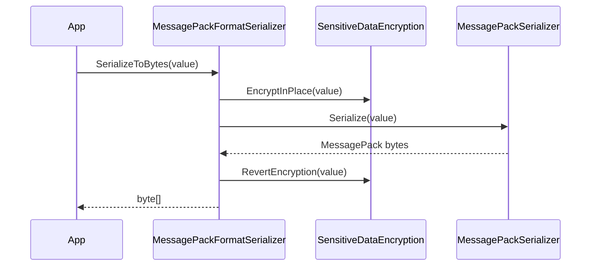

# MessagePack Serializer

## Contents

- [Overview](#overview)
- [Files](#files)
- [Types and members](#types-and-members)
- [Serialization and contracts](#serialization-and-contracts)
- [Validation and constraints](#validation-and-constraints)
- [Performance notes](#performance-notes)
- [Package dependencies](#package-dependencies)
- [Diagrams](#diagrams)
- [Examples](#examples)
- [See also](#see-also)

## Overview

The MessagePack module integrates MessagePack-CSharp with the ThunderPropagator format-serializer abstractions. It supports binary, stream, Base64, and MessagePack JSON representations, records serialization activities through the shared telemetry source, and applies the BuildingBlocks sensitive-data transform around object serialization.

## Files

| File | Primary type(s) | LOC (approx.) | Responsibility |
|---|---|---:|---|
| `AssemblyInfo.cs` | Assembly attributes | 3 | Exposes internals to unit tests and dynamic proxies. |
| `DependencyInjection.cs` | `DependencyInjection` | 20 | Registers the serializer and deserializer implementations. |
| `MessagePackFormatSerializer.cs` | `MessagePackFormatSerializer` | 58 | Adapts MessagePack to the common format contracts. |
| `MessagePackHelper.cs` | `MessagePackHelper` | 103 | Provides stream, byte, Base64, and JSON extension methods. |
| Project file | Package definition | 10 | Declares BuildingBlocks, MessagePack, and analyzer dependencies. |

## Types and members

| Type | Kind | Summary | Inherits/implements | Key members |
|---|---|---|---|---|
| `DependencyInjection` | Static class | Adds MessagePack format services to an `IServiceCollection`. | — | `AddMessagePackFormatSerializer` |
| `MessagePackFormatSerializer` | Sealed class | Common serializer adapter using ID `5` and `application/x-msgpack`. | `IFormatSerializer`, `IFormatDeserializer` | `Serialize`, `SerializeToBytes`, `Deserialize` |
| `MessagePackHelper` | Static class | Direct MessagePack conversion extensions. | — | `ToMessagePack*`, `FromMessagePack*` |

### DependencyInjection

- Namespace: `ThunderPropagator.FormatSerializers.MessagePack`
- `AddMessagePackFormatSerializer(IServiceCollection)` rejects a null collection, registers `MessagePackFormatSerializer` for both format interfaces, and returns the original collection.
- Registration follows normal `IServiceCollection` mutation semantics; configure it during application startup.

### MessagePackFormatSerializer

- `SerializerType` is `5`; `MediaType` is `application/x-msgpack`.
- `Serialize<T>` returns Base64 because raw MessagePack is binary.
- `SerializeToBytes<T>` returns the native MessagePack payload.
- Both deserialize overloads return `default` for empty input.
- The type is stateless and safe to reuse; effective thread safety depends on supplied MessagePack options and the serialized object graph.

### MessagePackHelper

- `ToMessagePackJson<T>` and `FromMessagePackJson<T>` bridge MessagePack's JSON representation.
- `ToMessagePack<T>`, `ToMessagePackBytes<T>`, and `ToMessagePackBase64<T>` produce stream, binary, and text-safe forms.
- `FromMessagePack<T>` accepts a stream or byte array; `FromMessagePackBase64<T>` accepts the text form.
- Every method accepts optional `MessagePackSerializerOptions` and a `CancellationToken`.
- Serializing temporarily encrypts members recognized by `SensitiveDataEncryption`; deserializing decrypts them.

[↑ Back to top](#contents)

## Serialization and contracts

The native wire contract is MessagePack. The common serializer's string representation is Base64-encoded MessagePack, not JSON. `ToMessagePackJson` is an explicit diagnostic/interchange alternative and should not be mixed with `Serialize<T>`.

## Validation and constraints

Null DI collections are rejected. Empty byte arrays and blank strings return `default` through the format adapter. Direct helper calls otherwise surface MessagePack, Base64, stream, and cancellation exceptions to the caller.

## Performance notes

Use byte or stream APIs on binary transports to avoid Base64's allocation and size overhead. Reuse immutable `MessagePackSerializerOptions` instances. Sensitive-data handling temporarily mutates the input object and restores it in `finally`; avoid concurrently serializing the same mutable instance.

## Package dependencies

| Package | Version | Description | Links |
|---|---:|---|---|
| `ThunderPropagator.BuildingBlocks` | `1.0.1-beta.114` | Format contracts, telemetry, DI helpers, and sensitive-data handling. | [Repository](https://github.com/KiarashMinoo/ThunderPropagator.BuildingBlocks) |
| `MessagePack` | `3.1.8` | MessagePack-CSharp runtime serializer. | [NuGet](https://www.nuget.org/packages/MessagePack/3.1.8) · [Repository](https://github.com/MessagePack-CSharp/MessagePack-CSharp) |
| `MessagePackAnalyzer` | `3.1.8` | Compile-time MessagePack diagnostics; private build asset. | [NuGet](https://www.nuget.org/packages/MessagePackAnalyzer/3.1.8) · [Repository](https://github.com/MessagePack-CSharp/MessagePack-CSharp) |

## Diagrams

### Serialization flow



The adapter wraps the underlying codec while preserving the original object after serialization.

## Examples

```csharp
using ThunderPropagator.FormatSerializers.MessagePack;

var bytes = order.ToMessagePackBytes();
var restored = bytes.FromMessagePack<Order>();

services.AddMessagePackFormatSerializer();
```

## See also

- [Documentation home](../README.md)
- [Protobuf](../Protobuf/README.md)
- [TOON](../Toon/README.md)

[↑ Back to top](#contents)
