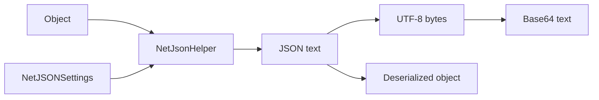

# NetJSON Serializer

## Contents

- [Overview](#overview)
- [Files](#files)
- [Types and members](#types-and-members)
- [Serialization and contracts](#serialization-and-contracts)
- [Validation and constraints](#validation-and-constraints)
- [Performance notes](#performance-notes)
- [Package dependencies](#package-dependencies)
- [Diagrams](#diagrams)
- [Examples](#examples)
- [See also](#see-also)

## Overview

The NetJSON module exposes NetJSON through ThunderPropagator's common serializer interfaces and direct extension methods. JSON defaults to camel case, honors the BuildingBlocks `JsonSerializationAttribute`, converts exceptions to `ExceptionInfo`, and integrates telemetry and sensitive-data protection.

## Files

| File | Primary type(s) | LOC (approx.) | Responsibility |
|---|---|---:|---|
| `AssemblyInfo.cs` | Assembly attributes | 3 | Exposes internals for testing and proxies. |
| `DependencyInjection.cs` | `DependencyInjection` | 20 | Registers the serializer and deserializer implementations. |
| `NetJsonFormatSerializer.cs` | `NetJsonFormatSerializer` | 57 | Implements the common format contracts. |
| `NetJsonHelper.cs` | `NetJsonHelper` | 137 | Provides JSON, UTF-8 byte, Base64, and runtime-type helpers. |
| Project file | Package definition | 6 | Declares BuildingBlocks and NetJSON dependencies. |

## Types and members

| Type | Kind | Summary | Inherits/implements | Key members |
|---|---|---|---|---|
| `DependencyInjection` | Static class | Adds NetJSON format services to an `IServiceCollection`. | — | `AddNetJsonFormatSerializer` |
| `NetJsonFormatSerializer` | Sealed class | JSON adapter using ID `3` and `application/json`. | `IFormatSerializer`, `IFormatDeserializer` | `Serialize`, `SerializeToBytes`, `Deserialize` |
| `NetJsonHelper` | Static class | Configurable NetJSON extension API. | — | `ToNetJson*`, `FromNetJson*` |

### DependencyInjection

- Namespace: `ThunderPropagator.FormatSerializers.NetJson`
- `AddNetJsonFormatSerializer(IServiceCollection)` rejects a null collection, registers `NetJsonFormatSerializer` for both format interfaces, and returns the original collection.
- Call it once while composing application services; the extension mutates the supplied service collection.

### NetJsonFormatSerializer

- `Serialize<T>` returns JSON text; `SerializeToBytes<T>` returns its UTF-8 encoding.
- `Deserialize<T>` accepts JSON text or UTF-8 bytes and returns `default` for empty input.
- The adapter is stateless; caller-supplied settings are created for each helper invocation.

### NetJsonHelper

- `ToNetJson<T>` accepts a callback that mutates and returns `NetJSONSettings`.
- `ToNetJsonBytes<T>` and `ToNetJsonBase64<T>` wrap the UTF-8 JSON representation.
- `FromNetJson<T>` supports generic targets; `FromNetJson(string, Type, ...)` supports runtime types.
- `FromNetJsonBytes<T>` and `FromNetJsonBase64<T>` return `default` for empty input.
- Defaults use camel-case property names unless a cached `JsonSerializationAttribute` disables them.
- Exceptions serialize through `ExceptionInfo`. Other objects receive the sensitive-data encryption/reversion cycle.

[↑ Back to top](#contents)

## Serialization and contracts

The text contract is JSON and the byte contract is UTF-8 JSON. Base64 helpers encode those UTF-8 bytes. Settings callbacks should return the provided settings object after configuration.

## Validation and constraints

Blank Base64 and JSON byte input is treated as absent. Invalid JSON, incompatible target types, and malformed Base64 surface the underlying exceptions. A settings callback can alter naming and other NetJSON behavior for a single operation.

## Performance notes

Prefer text APIs when the transport already handles UTF-8. Byte and Base64 helpers add encoding or encoding-plus-Base64 allocations. Avoid sharing a mutable `NetJSONSettings` object across concurrent operations.

## Package dependencies

| Package | Version | Description | Links |
|---|---:|---|---|
| `ThunderPropagator.BuildingBlocks` | `1.0.1-beta.114` | Shared serializer contracts, attributes, telemetry, and sensitive-data support. | [Repository](https://github.com/KiarashMinoo/ThunderPropagator.BuildingBlocks) |
| `NetJSON` | `1.4.5` | High-performance .NET JSON serializer. | [NuGet](https://www.nuget.org/packages/NetJSON/1.4.5) |

## Diagrams

### Representation flow



All public representations share the same configured JSON contract.

## Examples

```csharp
using ThunderPropagator.FormatSerializers.NetJson;

var json = order.ToNetJson(settings =>
{
    settings.CamelCase = true;
    return settings;
});
var restored = json.FromNetJson<Order>();
```

## See also

- [Documentation home](../README.md)
- [TOON](../Toon/README.md)
- [XML](../Xml/README.md)

[↑ Back to top](#contents)
