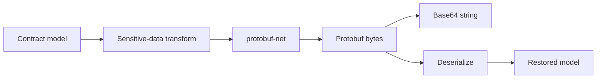

# Protobuf Serializer

## Contents

- [Overview](#overview)
- [Files](#files)
- [Types and members](#types-and-members)
- [Serialization and contracts](#serialization-and-contracts)
- [Validation and constraints](#validation-and-constraints)
- [Performance notes](#performance-notes)
- [Package dependencies](#package-dependencies)
- [Diagrams](#diagrams)
- [Examples](#examples)
- [See also](#see-also)

## Overview

The Protobuf module adapts protobuf-net to the ThunderPropagator serializer registry. It provides native stream and byte operations plus Base64 text transport, with shared telemetry and sensitive-data processing around the protobuf contract.

## Files

| File | Primary type(s) | LOC (approx.) | Responsibility |
|---|---|---:|---|
| `AssemblyInfo.cs` | Assembly attributes | 3 | Exposes internals for tests and dynamic proxies. |
| `ProtobufFormatSerializer.cs` | `ProtobufFormatSerializer` | 58 | Implements common serializer and deserializer contracts. |
| `ProtobufHelper.cs` | `ProtobufHelper` | 69 | Provides stream, byte-array, and Base64 extensions. |
| Project file | Package definition | 6 | Declares BuildingBlocks and protobuf-net dependencies. |

## Types and members

| Type | Kind | Summary | Inherits/implements | Key members |
|---|---|---|---|---|
| `ProtobufFormatSerializer` | Sealed class | Protobuf adapter using ID `4` and `application/x-protobuf`. | `IFormatSerializer`, `IFormatDeserializer` | `Serialize`, `SerializeToBytes`, `Deserialize` |
| `ProtobufHelper` | Static class | Direct protobuf-net conversion extensions. | — | `ToProtobuf*`, `FromProtobuf*` |

### ProtobufFormatSerializer

- `Serialize<T>` returns Base64-encoded protobuf bytes.
- `SerializeToBytes<T>` returns the native protobuf payload.
- `Deserialize<T>` accepts Base64 or bytes and returns `default` for empty input.
- Instances contain no mutable state.

### ProtobufHelper

- `ToProtobuf<T>` produces a readable `MemoryStream` positioned after the serialized payload.
- `ToProtobufBytes<T>` and `ToProtobufBase64<T>` produce portable representations.
- `FromProtobuf<T>` accepts a stream or byte array; `FromProtobufBase64<T>` decodes text.
- Serialization encrypts sensitive members temporarily and always restores them; deserialization decrypts sensitive members in the result.

[↑ Back to top](#contents)

## Serialization and contracts

Models must satisfy protobuf-net's serializable contract, typically through `[ProtoContract]` and `[ProtoMember]` or a configured runtime model. The string contract is Base64, while the byte and stream contracts are native protobuf.

## Validation and constraints

The common adapter handles empty input as `default`. Direct helpers surface malformed Base64, incompatible schemas, truncated payloads, and stream errors. Schema evolution should preserve field numbers and compatible wire types.

## Performance notes

Prefer stream or byte methods for binary transports. Base64 adds size and allocation overhead. Reuse stable protobuf models and avoid concurrently serializing the same mutable object when sensitive-data members are present.

## Package dependencies

| Package | Version | Description | Links |
|---|---:|---|---|
| `ThunderPropagator.BuildingBlocks` | `1.0.1-beta.111` | Shared format contracts, telemetry, helpers, and sensitive-data behavior. | [Repository](https://github.com/KiarashMinoo/ThunderPropagator.BuildingBlocks) |
| `protobuf-net` | `3.2.56` | Protocol Buffers serializer for .NET. | [NuGet](https://www.nuget.org/packages/protobuf-net/3.2.56) · [Repository](https://github.com/protobuf-net/protobuf-net) |

## Diagrams

### Contract flow



The Base64 representation is a transport wrapper around the same protobuf bytes.

## Examples

```csharp
using ProtoBuf;
using ThunderPropagator.FormatSerializers.Protobuf;

[ProtoContract]
public sealed class Order
{
    [ProtoMember(1)]
    public int Id { get; set; }
}

var payload = new Order { Id = 42 }.ToProtobufBytes();
var restored = payload.FromProtobuf<Order>();
```

## See also

- [Documentation home](../README.md)
- [MessagePack](../MessagePack/README.md)
- [YAML](../Yaml/README.md)

[↑ Back to top](#contents)
