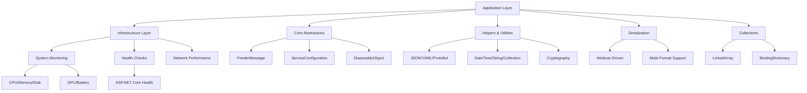

# ThunderPropagator BuildingBlocks Documentation

## Contents
- [Overview](#overview)
- [Architecture](#architecture)
- [Component Catalog](#component-catalog)
- [Quick Start](#quick-start)
- [See Also](#see-also)

## Overview

ThunderPropagator BuildingBlocks (Project ARC) provides production-ready, reusable components for building high-performance, cloud-native .NET applications. The library targets .NET 8.0, 9.0, and 10.0 with full multi-platform support (AnyCPU, x86, x64, ARM64).

The solution is architected in two primary layers: **Application** (core building blocks with zero infrastructure dependencies) and **Infrastructure** (system-level components for monitoring, health checks, and observability).

## Architecture



### Layer Responsibilities

- **Application Layer**: Core abstractions, helpers, serialization, collections, and utilities with **no infrastructure dependencies**
- **Infrastructure Layer**: System resource monitoring, health checks, network performance tracking, and platform-specific implementations

**Critical**: Application layer must NEVER depend on Infrastructure. This constraint is enforced by architecture tests in `Tests/ArchTests/ArchitectureTests.cs`.

## Component Catalog

### Application Layer

| Area | Types | Files | Diagrams | Description |
|------|-------|-------|----------|-------------|
| [BuildingBlocks.Application](./BuildingBlocks.Application/README.md) | 15 | 12 | ✓ | Core abstractions including FeederMessage, ServiceConfiguration, DisposableObject |
| [Attributes](./BuildingBlocks.Application/Attributes/README.md) | 2 | 2 | ✓ | JSON serialization control and member ignore attributes |
| [Certificate](./BuildingBlocks.Application/Certificate/README.md) | 1 | 1 | ✗ | X.509 certificate handling and management |
| [ChangeTrackingItems](./BuildingBlocks.Application/ChangeTrackingItems/README.md) | 5 | 5 | ✓ | Property change tracking with observable patterns |
| [Ciphering](./BuildingBlocks.Application/Ciphering/README.md) | 3 | 3 | ✓ | AES/RSA encryption and password generation |
| [Collections](./BuildingBlocks.Application/Collections/README.md) | 3 | 3 | ✓ | Specialized collections (LinkedArray, BindingDictionary, GenericOrderedDictionary) |
| [CorrelationId](./BuildingBlocks.Application/CorrelationId/README.md) | 3 | 3 | ✓ | Correlation ID management for distributed tracing |
| [Enums](./BuildingBlocks.Application/Enums/README.md) | 4 | 4 | ✗ | Common enumerations (AuthenticationType, CastType, DataType) |
| [Helpers](./BuildingBlocks.Application/Helpers/README.md) | 18 | 18 | ✓ | Comprehensive utility helpers for JSON, YAML, collections, strings, dates |
| [Identity](./BuildingBlocks.Application/Identity/README.md) | 1 | 1 | ✗ | JWT identity helper utilities |
| [Objects](./BuildingBlocks.Application/Objects/README.md) | 7 | 7 | ✓ | Base classes (DisposableObject, EquatableObject, NotifiableObject) |
| [Serializations](./BuildingBlocks.Application/Serializations/README.md) | 4 | 4 | ✓ | Serialization abstractions and Kafka serializer types |
| [Serializations/Json](./BuildingBlocks.Application/Serializations/Json/README.md) | 2 | 2 | ✓ | JSON-specific serializers for Kafka |
| [Serializations/Yaml](./BuildingBlocks.Application/Serializations/Yaml/README.md) | 2 | 2 | ✓ | YAML-specific serializers for Kafka |

### Infrastructure Layer

| Area | Types | Files | Diagrams | Description |
|------|-------|-------|----------|-------------|
| [BuildingBlocks.Infrastructure](./BuildingBlocks.Infrastructure/README.md) | 3 | 2 | ✓ | Infrastructure layer entry point and assembly info |
| [HealthChecks](./BuildingBlocks.Infrastructure/HealthChecks/README.md) | 0 | 0 | ✗ | ASP.NET Core health check integrations |
| [System](./BuildingBlocks.Infrastructure/System/README.md) | 0 | 0 | ✓ | System-level utilities and abstractions |
| [System/Network](./BuildingBlocks.Infrastructure/System/Network/README.md) | 2 | 2 | ✓ | Network performance monitoring and reporting |
| [SystemResourceMonitor](./BuildingBlocks.Infrastructure/SystemResourceMonitor/README.md) | 4 | 4 | ✓ | Cross-platform system resource monitoring framework |
| [SystemResourceMonitor/Metrics](./BuildingBlocks.Infrastructure/SystemResourceMonitor/Metrics/README.md) | 2 | 2 | ✓ | Metrics client abstractions and base interfaces |
| [SystemResourceMonitor/Metrics/Battery](./BuildingBlocks.Infrastructure/SystemResourceMonitor/Metrics/Battery/README.md) | 3 | 2 | ✓ | Battery status, charge, and health metrics (Windows/macOS/Linux) |
| [SystemResourceMonitor/Metrics/Cpu](./BuildingBlocks.Infrastructure/SystemResourceMonitor/Metrics/Cpu/README.md) | 4 | 4 | ✓ | CPU usage and temperature monitoring |
| [SystemResourceMonitor/Metrics/Disk](./BuildingBlocks.Infrastructure/SystemResourceMonitor/Metrics/Disk/README.md) | 6 | 4 | ✓ | Disk health (SMART) and I/O performance metrics |
| [SystemResourceMonitor/Metrics/Gpu](./BuildingBlocks.Infrastructure/SystemResourceMonitor/Metrics/Gpu/README.md) | 3 | 2 | ✓ | GPU utilization, memory, temperature (Windows/Linux) |
| [SystemResourceMonitor/Metrics/Memory](./BuildingBlocks.Infrastructure/SystemResourceMonitor/Metrics/Memory/README.md) | 2 | 2 | ✓ | System and process memory usage metrics |
| [SystemResourceMonitor/Metrics/SystemDrives](./BuildingBlocks.Infrastructure/SystemResourceMonitor/Metrics/SystemDrives/README.md) | 2 | 2 | ✓ | System drive enumeration and space metrics |

## Quick Start

### Installation

Packages are hosted on **GitHub Packages**. Configure your NuGet source:

```bash
dotnet nuget add source https://nuget.pkg.github.com/KiarashMinoo/index.json \
  --name "ThunderPropagator" \
  --username YOUR_GITHUB_USERNAME \
  --password YOUR_GITHUB_PAT
```

Install packages:

```bash
# Core application building blocks
dotnet add package ThunderPropagator.BuildingBlocks.Application

# Infrastructure components
dotnet add package ThunderPropagator.BuildingBlocks.Infrastructure
```

### Basic Usage

**FeederMessage Pattern**:

```csharp
using ThunderPropagator.BuildingBlocks.Application;

public class MyMessage : FeederMessage
{
    public Guid Id
    {
        get => GetValueOrDefault(Guid.NewGuid());
        set => SetValue(value);
    }
    
    public string? Name
    {
        get => GetValueOrNull<string>();
        set => SetValue(value);
    }
}

var message = new MyMessage
{
    Id = Guid.NewGuid(),
    Name = "Sample",
    CorrelationId = "req-12345"
};
```

**System Resource Monitoring**:

```csharp
using ThunderPropagator.BuildingBlocks.Infrastructure.SystemResourceMonitor;

services.AddSystemResourceMonitor(options =>
{
    options.EnableCpuMetrics = true;
    options.EnableMemoryMetrics = true;
    options.EnableDiskHealth = true;
    options.DefaultSamplingWindowMs = 500;
});

// In your service
public class MonitoringService
{
    private readonly ISystemResourceMonitor _monitor;
    
    public MonitoringService(ISystemResourceMonitor monitor)
    {
        _monitor = monitor;
    }
    
    public async Task<SystemResourceMonitorMetrics> GetMetricsAsync()
    {
        return await _monitor.Collect();
    }
}
```

**Serialization Helpers**:

```csharp
using ThunderPropagator.BuildingBlocks.Application.Helpers;

// JSON
var json = myObject.ToJson();
var obj = json.FromJson<MyType>();

// YAML
var yaml = myObject.ToYaml();
var obj = yaml.FromYaml<MyType>();

// ProtoBuf
var bytes = myObject.ToProtoBufBytes();
var obj = bytes.FromProtoBufBytes<MyType>();

// MessagePack
var base64 = myObject.ToMessagePackBase64();
var obj = base64.FromMessagePackBase64<MyType>();
```

## Design RFCs

| RFC | Title | Status |
|-----|-------|--------|
| [RFC-48](./RFC/RFC-48-FeederMessage-Envelope-Payload-Split.md) | FeederMessage Envelope/Payload Split | Proposed |

## See Also

- [Application Layer Documentation](./BuildingBlocks.Application/README.md)
- [Infrastructure Layer Documentation](./BuildingBlocks.Infrastructure/README.md)
- [Root README](../README.md)
- [Architecture Tests](../Tests/ArchTests/ArchitectureTests.cs)

---

**Last generated**: December 28, 2025  
**Total types documented**: 100+  
**Total files documented**: 92  
**Total diagrams**: 25+
