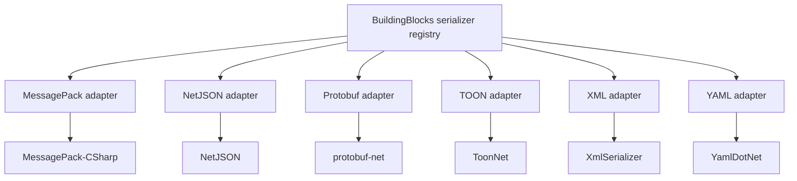

# ThunderPropagator Format Serializers Documentation

## Contents

- [Overview](#overview)
- [Serializer catalog](#serializer-catalog)
- [Format comparison](#format-comparison)
- [Shared behavior](#shared-behavior)
- [Package dependencies](#package-dependencies)
- [Diagrams](#diagrams)
- [Build and test](#build-and-test)
- [Coverage audit](#coverage-audit)

## Overview

This documentation covers the six .NET serializer packages in ThunderPropagator.FormatSerializers. Each package targets .NET 8, .NET 9, and .NET 10 and adapts a format to the `IFormatSerializer` and `IFormatDeserializer` contracts supplied by ThunderPropagator BuildingBlocks.

## Serializer catalog

| Area | Serializer ID | Media type | Native representation | Documentation |
|---|---:|---|---|---|
| MessagePack | 5 | `application/x-msgpack` | Binary | [MessagePack](./MessagePack/README.md) |
| NetJSON | 3 | `application/json` | UTF-8 text | [NetJSON](./NetJson/README.md) |
| Protobuf | 4 | `application/x-protobuf` | Binary | [Protobuf](./Protobuf/README.md) |
| TOON | 8 | `text/toon` | UTF-8 text | [TOON](./Toon/README.md) |
| XML | 6 | `application/xml` | UTF-8 text | [XML](./Xml/README.md) |
| YAML | 7 | `application/yaml` | UTF-8 text | [YAML](./Yaml/README.md) |

## Format comparison

| Format | Best suited to | String contract | Configuration surface |
|---|---|---|---|
| MessagePack | Compact, fast binary messaging | Base64-encoded MessagePack | `MessagePackSerializerOptions` |
| NetJSON | JSON interoperability | JSON | `NetJSONSettings` callback |
| Protobuf | Schema-conscious binary messaging | Base64-encoded protobuf | protobuf-net model configuration |
| TOON | Compact token-oriented text | TOON | `ToonOptions` / `ToonDecodeOptions` callbacks |
| XML | Framework-native XML contracts | XML | `System.Xml.Serialization` attributes |
| YAML | Human-editable configuration and extensible contracts | YAML | `YamlSerializerSettings`, converters, node deserializers |

## Shared behavior

- Format adapters expose serializer IDs and media types for registry-based selection.
- Serialization and deserialization activities are emitted only when the shared `Telemetry` source has listeners.
- MessagePack, NetJSON, Protobuf, XML, and YAML integrate `SensitiveDataEncryption`; TOON currently relies on its JSON contract configuration and does not call that transform directly.
- Binary formats use Base64 for the common interface's string representation.
- Empty deserialize input generally returns `default`; direct helper methods may surface codec-specific exceptions.

## Package dependencies

| Package | Version | Authors | License | Used by | Registry / project |
|---|---:|---|---|---|---|
| `ThunderPropagator.BuildingBlocks` | `1.0.1-beta.114` | ThunderPropagator | Apache-2.0 | All modules | [Repository](https://github.com/KiarashMinoo/ThunderPropagator.BuildingBlocks) |
| `MessagePack` | `3.1.8` | neuecc, aarnott | MIT | [MessagePack](./MessagePack/README.md#package-dependencies) | [NuGet](https://www.nuget.org/packages/MessagePack/3.1.8) · [Project](https://github.com/MessagePack-CSharp/MessagePack-CSharp) |
| `MessagePackAnalyzer` | `3.1.8` | neuecc, aarnott | MIT | [MessagePack](./MessagePack/README.md#package-dependencies) | [NuGet](https://www.nuget.org/packages/MessagePackAnalyzer/3.1.8) · [Project](https://github.com/MessagePack-CSharp/MessagePack-CSharp) |
| `NetJSON` | `1.4.5` | TJ Bakre | Not declared | [NetJSON](./NetJson/README.md#package-dependencies) | [NuGet](https://www.nuget.org/packages/NetJSON/1.4.5) · [Project](https://github.com/rpgmaker/NetJSON) |
| `protobuf-net` | `3.2.56` | Marc Gravell | Apache-2.0 | [Protobuf](./Protobuf/README.md#package-dependencies) | [NuGet](https://www.nuget.org/packages/protobuf-net/3.2.56) · [Project](https://github.com/protobuf-net/protobuf-net) |
| `ToonNet` | `1.0.4` | Nicola Santoro | MIT | [TOON](./Toon/README.md#package-dependencies) | [NuGet](https://www.nuget.org/packages/ToonNet/1.0.4) · [Project](https://github.com/Nicola898989/ToonNet) |
| `YamlDotNet` | `18.1.0` | Antoine Aubry | MIT | [YAML](./Yaml/README.md#package-dependencies) | [NuGet](https://www.nuget.org/packages/YamlDotNet/18.1.0) · [Project](https://github.com/aaubry/YamlDotNet) |

## Diagrams

### Repository architecture


Each package can be referenced independently while sharing the same registry-facing contracts.

## Build and test

```bash
dotnet restore
dotnet build -c Release
dotnet test -c Release
```

## Coverage audit

The source tree was canonicalized by removing `src` and the `ThunderPropagator.FormatSerializers` prefix. Test and build-output folders were excluded.

| Source area | Canonical docs area | Required sections | Diagrams | Retries | Result |
|---|---|---|---|---:|---|
| MessagePack | `MessagePack` | Present | 1 | 0 | ✅ |
| NetJson | `NetJson` | Present | 1 | 0 | ✅ |
| Protobuf | `Protobuf` | Present | 1 | 0 | ✅ |
| Toon | `Toon` | Present | 1 | 0 | ✅ |
| Xml | `Xml` | Present | 1 | 0 | ✅ |
| Yaml | `Yaml` | Present | 2 | 0 | ✅ |

No canonical path collisions were detected. No folder required heuristic fallback content.

[↑ Back to top](#contents)
