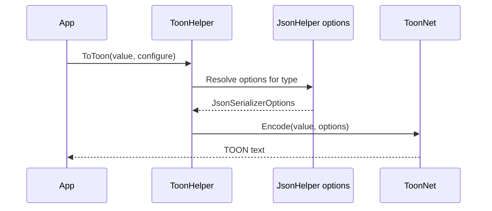

# TOON Serializer

## Contents

- [Overview](#overview)
- [Files](#files)
- [Types and members](#types-and-members)
- [Serialization and contracts](#serialization-and-contracts)
- [Validation and constraints](#validation-and-constraints)
- [Performance notes](#performance-notes)
- [Package dependencies](#package-dependencies)
- [Diagrams](#diagrams)
- [Examples](#examples)
- [See also](#see-also)

## Overview

The TOON module integrates ToonNet's Token-Oriented Object Notation encoding with the common ThunderPropagator serializer contracts. It offers text, UTF-8 byte, and Base64 representations and derives its JSON serializer configuration from BuildingBlocks so existing JSON metadata remains effective.

## Files

| File | Primary type(s) | LOC (approx.) | Responsibility |
|---|---|---:|---|
| `AssemblyInfo.cs` | Assembly attributes | 3 | Exposes internals for tests and dynamic proxies. |
| `ToonFormatSerializer.cs` | `ToonFormatSerializer` | 58 | Implements the common format contracts. |
| `ToonHelper.cs` | `ToonHelper` | 101 | Provides configurable TOON conversion extensions. |
| Project file | Package definition | 6 | Declares BuildingBlocks and ToonNet dependencies. |

## Types and members

| Type | Kind | Summary | Inherits/implements | Key members |
|---|---|---|---|---|
| `ToonFormatSerializer` | Sealed class | TOON adapter using ID `8` and `text/toon`. | `IFormatSerializer`, `IFormatDeserializer` | `Serialize`, `SerializeToBytes`, `Deserialize` |
| `ToonHelper` | Static class | Direct text, UTF-8 byte, and Base64 conversion API. | — | `ToToon*`, `FromToon*` |

### ToonFormatSerializer

- `Serialize<T>` returns TOON text; `SerializeToBytes<T>` returns UTF-8 TOON.
- `Deserialize<T>` accepts text or UTF-8 bytes and returns `default` for blank or empty input.
- The adapter is stateless and delegates configuration to the helper defaults.

### ToonHelper

- `ToToon<T>` accepts a `Func<ToonOptions, ToonOptions>` configuration callback.
- `ToToonBytes<T>` and `ToToonBase64<T>` wrap the encoded text.
- `FromToon<T>` accepts a separate `Func<ToonDecodeOptions, ToonDecodeOptions>` callback.
- Byte and Base64 deserialization return `default` for empty input.
- Default `ToonOptions.SerializerOptions` come from `JsonHelper` and are adjusted for the serialized type.
- Exceptions are converted to the shared `ExceptionInfo` representation before encoding.

[↑ Back to top](#contents)

## Serialization and contracts

The canonical contract is TOON text. Byte payloads are UTF-8, and Base64 payloads encode those UTF-8 bytes. Encoding and decoding options are distinct types, so callers should configure the correct callback for each direction.

## Validation and constraints

Blank Base64 or empty byte input produces `default`. Malformed TOON, incompatible models, or malformed Base64 surface ToonNet or framework exceptions. Because JSON serializer options influence model handling, review polymorphism and naming settings for externally supplied data.

## Performance notes

Use the text representation when possible; byte and Base64 variants add encoding allocations. Configuration callbacks create per-call option objects, which avoids shared mutable settings but may matter in very hot paths.

## Package dependencies

| Package | Version | Description | Links |
|---|---:|---|---|
| `ThunderPropagator.BuildingBlocks` | `1.0.1-beta.111` | Common serializer contracts, JSON options, telemetry, and exception models. | [Repository](https://github.com/KiarashMinoo/ThunderPropagator.BuildingBlocks) |
| `ToonNet` | `1.0.4` | TOON encoder and decoder for .NET. | [NuGet](https://www.nuget.org/packages/ToonNet/1.0.4) |

## Diagrams

### Encoding flow



TOON encoding reuses the repository's JSON contract configuration before calling ToonNet.

## Examples

```csharp
using ThunderPropagator.FormatSerializers.Toon;

var toon = order.ToToon();
var restored = toon.FromToon<Order>();
var transportValue = order.ToToonBase64();
```

## See also

- [Documentation home](../README.md)
- [NetJSON](../NetJson/README.md)
- [YAML](../Yaml/README.md)

[↑ Back to top](#contents)
