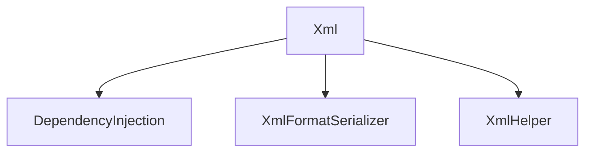

# Xml

## Contents

- [Overview](#overview)
- [Files](#files)
- [Types and Members](#types-and-members)
- [Serialization and Contracts](#serialization-and-contracts)
- [Validation and Constraints](#validation-and-constraints)
- [Performance Notes](#performance-notes)
- [Package Dependencies](#package-dependencies)
- [Diagrams](#diagrams)
- [Examples](#examples)
- [See Also](#see-also)

## Overview

The **Xml** area groups 3 documented types, including `DependencyInjection`, `XmlFormatSerializer`, `XmlHelper`. It provides the contracts and implementation used by this part of ThunderPropagator.FormatSerializers.

## Files

| File | Primary type(s)/symbol(s) | LOC (approx.) | Responsibility |
|---|---|---:|---|
| `AssemblyInfo.cs` | — | 4 | Contains the assembly info implementation or configuration. |
| `DependencyInjection.cs` | `DependencyInjection` | 22 | Defines DependencyInjection and its related behavior. |
| `ThunderPropagator.FormatSerializers.Xml.csproj` | — | 7 | Defines project build targets, dependencies, and package metadata. |
| `XmlFormatSerializer.cs` | `XmlFormatSerializer` | 70 | Defines XmlFormatSerializer and its related behavior. |
| `XmlHelper.cs` | `XmlHelper` | 115 | Defines XmlHelper and its related behavior. |

## Types and Members

| Type | Kind | Summary | Inherits/Implements | Key Members |
|---|---|---|---|---|
| [`DependencyInjection`](#dependencyinjection) | class | Extension methods for registering ThunderPropagator BuildingBlocks services. | — | `AddXmlFormatSerializer(…)` |
| [`XmlFormatSerializer`](#xmlformatserializer) | class | and implementation backed by System.Xml.Serialization . | `IFormatSerializer, IFormatDeserializer` | `SerializerType`, `MediaType` |
| [`XmlHelper`](#xmlhelper) | class | Represents the XmlHelper class. | — | — |

### DependencyInjection

- **Kind:** class
- **Namespace:** `ThunderPropagator.FormatSerializers.Xml`
- **Inherits/implements:** None declared
- **Attributes:** None detected
- **Key members:** `AddXmlFormatSerializer(…)`
- **Summary:** Extension methods for registering ThunderPropagator BuildingBlocks services.
- **Thread safety:** Follow the lifetime and concurrency guarantees of the owning component; no additional guarantee is inferred.

**Usage recipe**

```csharp
// Resolve DependencyInjection from the configured service container or construct it with its declared dependencies.
```

[↑ Back to top](#contents)

### XmlFormatSerializer

- **Kind:** class
- **Namespace:** `ThunderPropagator.FormatSerializers.Xml`
- **Inherits/implements:** `IFormatSerializer, IFormatDeserializer`
- **Attributes:** None detected
- **Key members:** `SerializerType`, `MediaType`
- **Summary:** and implementation backed by System.Xml.Serialization .
- **Thread safety:** Follow the lifetime and concurrency guarantees of the owning component; no additional guarantee is inferred.

**Usage recipe**

```csharp
// Resolve XmlFormatSerializer from the configured service container or construct it with its declared dependencies.
```

[↑ Back to top](#contents)

### XmlHelper

- **Kind:** class
- **Namespace:** `ThunderPropagator.FormatSerializers.Xml`
- **Inherits/implements:** None declared
- **Attributes:** None detected
- **Key members:** Refer to the API surface in the source package
- **Summary:** Represents the XmlHelper class.
- **Thread safety:** Follow the lifetime and concurrency guarantees of the owning component; no additional guarantee is inferred.

**Usage recipe**

```csharp
// Resolve XmlHelper from the configured service container or construct it with its declared dependencies.
```

[↑ Back to top](#contents)

## Serialization and Contracts

Serialization behavior is part of the public wire or persistence contract in this area. Preserve field names, ordering rules, content negotiation, and backward-compatibility expectations when changing these types.

## Validation and Constraints

Inputs are validated at component boundaries. Callers should provide non-null required values and handle domain or argument exceptions without retrying invalid requests unchanged.

## Performance Notes

This area contains performance-sensitive constructs such as pooled buffers, spans, asynchronous value types, or concurrent collections. Avoid unnecessary allocations and blocking calls on streaming or message-processing paths.

## Package Dependencies

| Package | Version | Description | Links |
|---|---|---|---|
| `MessagePack` | `3.1.8` | External dependency used by the repository. | [Registry](https://www.nuget.org/packages/MessagePack) |
| `MessagePackAnalyzer` | `3.1.8` | External dependency used by the repository. | [Registry](https://www.nuget.org/packages/MessagePackAnalyzer) |
| `NetJSON` | `1.4.5` | External dependency used by the repository. | [Registry](https://www.nuget.org/packages/NetJSON) |
| `protobuf-net` | `3.2.56` | External dependency used by the repository. | [Registry](https://www.nuget.org/packages/protobuf-net) |
| `ToonNet` | `1.0.4` | External dependency used by the repository. | [Registry](https://www.nuget.org/packages/ToonNet) |
| `YamlDotNet` | `18.1.0` | External dependency used by the repository. | [Registry](https://www.nuget.org/packages/YamlDotNet) |

## Diagrams

### Component overview



The diagram shows the direct components documented by the **Xml** area.

## Examples

Start with `DependencyInjection` as the primary entry point for this folder, then follow its linked contracts and collaborators.

## See Also

- [Documentation home](../README.md)
- [MessagePack](../MessagePack/README.md)
- [NetJson](../NetJson/README.md)
- [Protobuf](../Protobuf/README.md)
- [Toon](../Toon/README.md)
- [Yaml](../Yaml/README.md)

[↑ Back to top](#contents)
