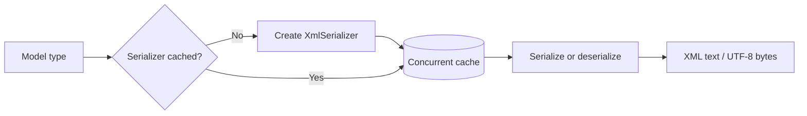

# XML Serializer

## Contents

- [Overview](#overview)
- [Files](#files)
- [Types and members](#types-and-members)
- [Serialization and contracts](#serialization-and-contracts)
- [Validation and constraints](#validation-and-constraints)
- [Performance notes](#performance-notes)
- [Package dependencies](#package-dependencies)
- [Diagrams](#diagrams)
- [Examples](#examples)
- [See also](#see-also)

## Overview

The XML module wraps the .NET `XmlSerializer` behind ThunderPropagator's format contracts and direct extension methods. It provides XML text, UTF-8 bytes without a byte-order mark, and Base64, while caching serializers and applying shared telemetry and sensitive-data transformations.

## Files

| File | Primary type(s) | LOC (approx.) | Responsibility |
|---|---|---:|---|
| `AssemblyInfo.cs` | Assembly attributes | 3 | Exposes internals for tests and dynamic proxies. |
| `XmlFormatSerializer.cs` | `XmlFormatSerializer` | 57 | Implements common format contracts. |
| `XmlHelper.cs` | `XmlHelper` | 106 | Caches `XmlSerializer` instances and provides conversion extensions. |
| Project file | Package definition | 5 | Declares the BuildingBlocks dependency. |

## Types and members

| Type | Kind | Summary | Inherits/implements | Key members |
|---|---|---|---|---|
| `XmlFormatSerializer` | Sealed class | XML adapter using ID `6` and `application/xml`. | `IFormatSerializer`, `IFormatDeserializer` | `Serialize`, `SerializeToBytes`, `Deserialize` |
| `XmlHelper` | Static class | XML text, byte, and Base64 conversion API. | — | `ToXml*`, `FromXml*` |

### XmlFormatSerializer

- `Serialize<T>` returns XML text; `SerializeToBytes<T>` returns UTF-8 XML.
- `Deserialize<T>` accepts text or bytes and returns `default` for empty input.
- The adapter is stateless and uses `XmlHelper` for all operations.

### XmlHelper

- `ToXml<T>`, `ToXmlBytes<T>`, and `ToXmlBase64<T>` provide the three transport forms.
- `FromXml<T>`, `FromXmlBytes<T>`, and `FromXmlBase64<T>` restore typed objects.
- A process-wide `ConcurrentDictionary<Type, XmlSerializer>` amortizes serializer construction and is safe for concurrent lookups.
- UTF-8 byte output explicitly omits the BOM.
- Sensitive members are encrypted temporarily during serialization and decrypted after deserialization.

[↑ Back to top](#contents)

## Serialization and contracts

Models follow `System.Xml.Serialization` rules and may customize the contract with attributes such as `[XmlRoot]`, `[XmlElement]`, and `[XmlAttribute]`. Base64 is only a transport wrapper around the UTF-8 XML bytes.

## Validation and constraints

`XmlSerializer` generally requires a public parameterless constructor and serializable public members. Blank strings and empty byte arrays return `default`; malformed XML, incompatible contracts, and malformed Base64 surface exceptions.

## Performance notes

Serializer caching avoids repeated dynamic serializer construction. The cache retains one serializer per encountered runtime type for the process lifetime. Use direct XML text or bytes instead of Base64 where the transport permits.

## Package dependencies

| Package | Version | Description | Links |
|---|---:|---|---|
| `ThunderPropagator.BuildingBlocks` | `1.0.1-beta.111` | Common serializer contracts, telemetry, and sensitive-data behavior. | [Repository](https://github.com/KiarashMinoo/ThunderPropagator.BuildingBlocks) |
| `.NET XmlSerializer` | .NET 8–10 | Framework XML serialization implementation. | [API documentation](https://learn.microsoft.com/dotnet/api/system.xml.serialization.xmlserializer) |

## Diagrams

### Cached serializer flow



Each model type shares a cached `XmlSerializer` across subsequent operations.

## Examples

```csharp
using System.Xml.Serialization;
using ThunderPropagator.FormatSerializers.Xml;

[XmlRoot("order")]
public sealed class Order
{
    [XmlAttribute("id")]
    public int Id { get; set; }
}

var xml = new Order { Id = 42 }.ToXml();
var restored = xml.FromXml<Order>();
```

## See also

- [Documentation home](../README.md)
- [NetJSON](../NetJson/README.md)
- [YAML](../Yaml/README.md)

[↑ Back to top](#contents)
