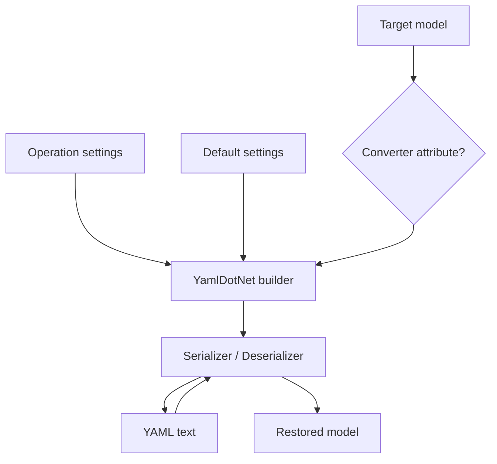
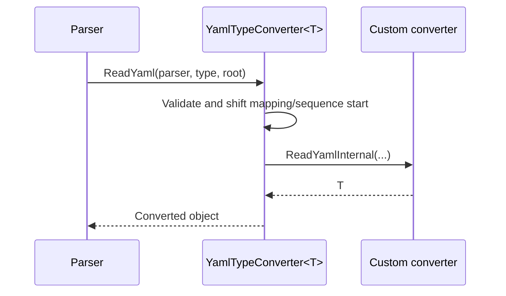

# YAML Serializer

## Contents

- [Overview](#overview)
- [Files](#files)
- [Types and members](#types-and-members)
- [Serialization and contracts](#serialization-and-contracts)
- [Validation and constraints](#validation-and-constraints)
- [Performance notes](#performance-notes)
- [Package dependencies](#package-dependencies)
- [Diagrams](#diagrams)
- [Examples](#examples)
- [See also](#see-also)

## Overview

The YAML module provides the most extensible serializer integration in this repository. It wraps YamlDotNet with common format contracts, configurable naming and construction rules, type- and node-level extension points, UTF-8/Base64 helpers, telemetry, and sensitive-data handling.

## Files

| File | Primary type(s) | LOC (approx.) | Responsibility |
|---|---|---:|---|
| `AssemblyInfo.cs` | Assembly attributes | 3 | Exposes internals for tests and dynamic proxies. |
| `YamlFormatSerializer.cs` | `YamlFormatSerializer` | 59 | Implements common format contracts. |
| `YamlHelper.cs` | `YamlHelper` | 231 | Builds configured YamlDotNet serializers and exposes conversion helpers. |
| `YamlNodeDeserializerAttribute.cs` | `YamlNodeDeserializerAttribute` | 11 | Associates a node deserializer with a model. |
| `YamlSerializerSettings.cs` | `YamlSerializerSettings` | 22 | Holds per-operation/default YAML configuration. |
| `YamlTypeConverter.cs` | Converter abstractions | 235 | Supplies generic and non-generic converter base classes and parsing helpers. |
| `YamlTypeConverterAttribute.cs` | `YamlTypeConverterAttribute` | 13 | Associates a YAML type converter with a model. |
| Project file | Package definition | 6 | Declares BuildingBlocks and YamlDotNet dependencies. |

## Types and members

| Type | Kind | Summary | Inherits/implements | Key members |
|---|---|---|---|---|
| `YamlFormatSerializer` | Sealed class | YAML adapter using ID `7` and `application/yaml`. | `IFormatSerializer`, `IFormatDeserializer` | `Serialize`, `SerializeToBytes`, `Deserialize` |
| `YamlHelper` | Static class | Configures YamlDotNet and exposes text, byte, Base64, and runtime-type methods. | — | `DefaultSerializerSettings`, `ToYaml*`, `FromYaml*` |
| `YamlSerializerSettings` | Class | YAML serializer/deserializer options. | — | naming, resolver, converter, and construction properties |
| `YamlTypeConverterAttribute` | Attribute | Associates an `IYamlTypeConverter` type with a model. | `Attribute` | `ConverterType` |
| `YamlNodeDeserializerAttribute` | Attribute | Associates an `INodeDeserializer` type with a model. | `Attribute` | `NodeDeserializer` |
| `IYamlTypeConverter<T>` | Interface | Strongly typed YAML read/write extension. | `IYamlTypeConverter` | `ReadYaml`, `WriteYaml` |
| `BaseYamlTypeConverter` | Abstract class | Common parser/emitter helpers for custom converters. | — | `Accepts`, mapping/sequence, scalar, enum, boolean, and number helpers |
| `YamlTypeConverter` | Abstract class | Non-generic object converter base. | `BaseYamlTypeConverter`, `IYamlTypeConverter` | `WriteYamlInternal`, `ReadYamlInternal` |
| `YamlTypeConverter<T>` | Abstract class | Strongly typed converter base. | `BaseYamlTypeConverter`, `IYamlTypeConverter<T>` | `Accepts`, `WriteYamlInternal`, `ReadYamlInternal` |

### YamlFormatSerializer

- `Serialize<T>` returns YAML text; `SerializeToBytes<T>` returns UTF-8.
- `Deserialize<T>` accepts YAML text or UTF-8 bytes and returns `default` for empty input.
- Instances are stateless, but they read the mutable global defaults on each operation.

### YamlHelper

- `DefaultSerializerSettings` initially uses `CamelCaseNamingConvention`.
- `ToYaml<T>`, `ToYamlBytes<T>`, and `ToYamlBase64<T>` accept optional per-operation settings.
- `FromYaml<T>` supports generic targets; `FromYaml(string, Type, ...)` supports runtime types.
- `FromYamlBytes<T>` and `FromYamlBase64<T>` support transport forms.
- Per-operation settings take precedence over defaults. Type converters are collected from the target attribute, operation settings, and global defaults.
- Node deserializers are collected in the same order for deserialization.
- Sensitive members are encrypted and restored during serialization, then decrypted after deserialization.

### YamlSerializerSettings

| Property | Type | Default | Effect |
|---|---|---|---|
| `Style` | `ScalarStyle?` | `null` | Sets the default scalar style. |
| `JsonCompatible` | `bool` | `false` | Emits JSON-compatible YAML. |
| `IgnoreFields` | `bool` | `false` | Excludes fields. |
| `IncludeNonPublicProperties` | `bool` | `false` | Includes non-public properties. |
| `EnablePrivateConstructors` | `bool` | `false` | Allows private constructors. |
| `NamingConvention` | `INamingConvention?` | global camel case | Controls member names. |
| `EnumNamingConvention` | `INamingConvention?` | `null` | Controls enum values. |
| `TypeResolver` | `ITypeResolver?` | `null` | Resolves runtime YAML types. |
| `TypeConverters` | `IEnumerable<IYamlTypeConverter>?` | `null` | Adds custom value converters. |
| `NodeDeserializers` | `IEnumerable<INodeDeserializer>?` | `null` | Adds custom node deserializers. |

This class is mutable. Treat configured instances as immutable while an operation is running.

### YamlTypeConverterAttribute

Apply the attribute to a class, interface, struct, enum, property, or field. `ConverterType` must be constructible by `Activator.CreateInstance` and implement `IYamlTypeConverter`; invalid types fail at runtime.

### YamlNodeDeserializerAttribute

Apply the attribute to a class, interface, struct, enum, property, or field. `NodeDeserializer` must be constructible and implement YamlDotNet's `INodeDeserializer`.

### Converter base types

`BaseYamlTypeConverter` provides protected helpers for consuming mapping/sequence boundaries, reading and writing keys/scalars, delegating nested serialization, and converting enums, booleans, and generic numeric types. `YamlTypeConverter` is suitable when one implementation handles runtime types; `YamlTypeConverter<T>` automatically accepts only `T` and exposes typed abstract methods.

[↑ Back to top](#contents)

## Serialization and contracts

The canonical contract is YAML text. Byte output uses UTF-8 and Base64 wraps those bytes. Serializer settings affect both syntax and object construction, so producers and consumers should agree on naming conventions, converter registration, and resolver behavior.

## Validation and constraints

Custom converter and node-deserializer types are instantiated reflectively and require usable parameterless constructors. Converter base classes reject content that does not begin with a mapping or sequence. Blank Base64 and empty bytes return `default`; malformed YAML and conversion failures surface exceptions.

## Performance notes

YamlDotNet serializer/deserializer builders are rebuilt for each operation, favoring configuration isolation over maximum throughput. Global settings are mutable and not synchronized; configure them once during startup or pass operation-local settings. Avoid concurrent serialization of the same sensitive mutable object.

## Package dependencies

| Package | Version | Description | Links |
|---|---:|---|---|
| `ThunderPropagator.BuildingBlocks` | `1.0.1-beta.111` | Common contracts, telemetry, and sensitive-data processing. | [Repository](https://github.com/KiarashMinoo/ThunderPropagator.BuildingBlocks) |
| `YamlDotNet` | `18.1.0` | YAML parser, emitter, serializer, and extension contracts. | [NuGet](https://www.nuget.org/packages/YamlDotNet/18.1.0) · [Repository](https://github.com/aaubry/YamlDotNet) |

## Diagrams

### Configuration and conversion



Target attributes, local settings, and global defaults converge when each YamlDotNet codec is built.

### Custom converter sequence



The base class validates the node boundary before delegating domain-specific parsing.

## Examples

```csharp
using ThunderPropagator.FormatSerializers.Yaml;
using YamlDotNet.Serialization.NamingConventions;

var settings = new YamlSerializerSettings
{
    NamingConvention = UnderscoredNamingConvention.Instance,
    IgnoreFields = true
};

var yaml = order.ToYaml(settings);
var restored = yaml.FromYaml<Order>(settings);
```

## See also

- [Documentation home](../README.md)
- [NetJSON](../NetJson/README.md)
- [XML](../Xml/README.md)

[↑ Back to top](#contents)
