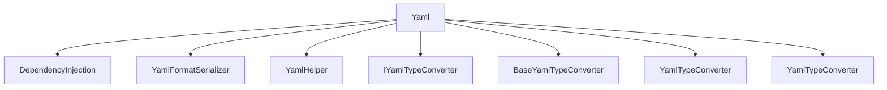

# Yaml

## Contents

- [Overview](#overview)
- [Files](#files)
- [Types and Members](#types-and-members)
- [Serialization and Contracts](#serialization-and-contracts)
- [Validation and Constraints](#validation-and-constraints)
- [Package Dependencies](#package-dependencies)
- [Diagrams](#diagrams)
- [Examples](#examples)
- [See Also](#see-also)

## Overview

The **Yaml** area groups 7 documented types, including `DependencyInjection`, `YamlFormatSerializer`, `YamlHelper`, `IYamlTypeConverter`, `BaseYamlTypeConverter`. It provides the contracts and implementation used by this part of ThunderPropagator.FormatSerializers.

## Files

| File | Primary type(s)/symbol(s) | LOC (approx.) | Responsibility |
|---|---|---:|---|
| `AssemblyInfo.cs` | — | 4 | Contains the assembly info implementation or configuration. |
| `DependencyInjection.cs` | `DependencyInjection` | 22 | Defines DependencyInjection and its related behavior. |
| `ThunderPropagator.FormatSerializers.Yaml.csproj` | — | 8 | Defines project build targets, dependencies, and package metadata. |
| `YamlFormatSerializer.cs` | `YamlFormatSerializer` | 72 | Defines YamlFormatSerializer and its related behavior. |
| `YamlHelper.cs` | `YamlHelper` | 237 | Defines YamlHelper and its related behavior. |
| `YamlNodeDeserializerAttribute.cs` | `YamlNodeDeserializerAttribute` | 13 | Defines YamlNodeDeserializerAttribute and its related behavior. |
| `YamlSerializerSettings.cs` | `YamlSerializerSettings` | 24 | Defines YamlSerializerSettings and its related behavior. |
| `YamlTypeConverter.cs` | `IYamlTypeConverter`, `BaseYamlTypeConverter`, `YamlTypeConverter`, `YamlTypeConverter` | 243 | Defines IYamlTypeConverter, BaseYamlTypeConverter, YamlTypeConverter and its related behavior. |
| `YamlTypeConverterAttribute.cs` | `YamlTypeConverterAttribute` | 14 | Defines YamlTypeConverterAttribute and its related behavior. |

## Types and Members

| Type | Kind | Summary | Inherits/Implements | Key Members |
|---|---|---|---|---|
| [`DependencyInjection`](#dependencyinjection) | class | Extension methods for registering ThunderPropagator BuildingBlocks services. | — | `AddYamlFormatSerializer(…)` |
| [`YamlFormatSerializer`](#yamlformatserializer) | class | and implementation backed by YamlDotNet. | `IFormatSerializer, IFormatDeserializer` | `SerializerType`, `MediaType` |
| [`YamlHelper`](#yamlhelper) | class | Represents the YamlHelper class. | — | `DefaultSerializerSettings` |
| [`IYamlTypeConverter`](#iyamltypeconverter) | interface | Represents the IYamlTypeConverter interface. | `IYamlTypeConverter` | `Accepts(…)`, `GetYamlTypeConverter(…)`, `ShiftIf(…)`, `IsMappingStart(…)`, `IsMappingEnd(…)`, `IsSequenceStart(…)` |
| [`BaseYamlTypeConverter`](#baseyamltypeconverter) | class | Represents the BaseYamlTypeConverter class. | — | `Accepts(…)`, `GetYamlTypeConverter(…)`, `ShiftIf(…)`, `IsMappingStart(…)`, `IsMappingEnd(…)`, `IsSequenceStart(…)` |
| [`YamlTypeConverter`](#yamltypeconverter) | class | Represents the YamlTypeConverter class. | `BaseYamlTypeConverter, IYamlTypeConverter` | `WriteYamlInternal(…)`, `ReadYamlInternal(…)`, `Accepts(…)`, `WriteYamlInternal(…)`, `ReadYamlInternal(…)` |
| [`YamlTypeConverter`](#yamltypeconverter) | class | Represents the YamlTypeConverter class. | `BaseYamlTypeConverter, IYamlTypeConverter<T>` | `Accepts(…)`, `WriteYamlInternal(…)`, `ReadYamlInternal(…)` |

### DependencyInjection

- **Kind:** class
- **Namespace:** `ThunderPropagator.FormatSerializers.Yaml`
- **Inherits/implements:** None declared
- **Attributes:** None detected
- **Key members:** `AddYamlFormatSerializer(…)`
- **Summary:** Extension methods for registering ThunderPropagator BuildingBlocks services.
- **Thread safety:** Follow the lifetime and concurrency guarantees of the owning component; no additional guarantee is inferred.

**Usage recipe**

```csharp
// Resolve DependencyInjection from the configured service container or construct it with its declared dependencies.
```

[↑ Back to top](#contents)

### YamlFormatSerializer

- **Kind:** class
- **Namespace:** `ThunderPropagator.FormatSerializers.Yaml`
- **Inherits/implements:** `IFormatSerializer, IFormatDeserializer`
- **Attributes:** None detected
- **Key members:** `SerializerType`, `MediaType`
- **Summary:** and implementation backed by YamlDotNet.
- **Thread safety:** Follow the lifetime and concurrency guarantees of the owning component; no additional guarantee is inferred.

**Usage recipe**

```csharp
// Resolve YamlFormatSerializer from the configured service container or construct it with its declared dependencies.
```

[↑ Back to top](#contents)

### YamlHelper

- **Kind:** class
- **Namespace:** `ThunderPropagator.FormatSerializers.Yaml`
- **Inherits/implements:** None declared
- **Attributes:** None detected
- **Key members:** `DefaultSerializerSettings`
- **Summary:** Represents the YamlHelper class.
- **Thread safety:** Follow the lifetime and concurrency guarantees of the owning component; no additional guarantee is inferred.

**Usage recipe**

```csharp
// Resolve YamlHelper from the configured service container or construct it with its declared dependencies.
```

[↑ Back to top](#contents)

### IYamlTypeConverter

- **Kind:** interface
- **Namespace:** `ThunderPropagator.FormatSerializers.Yaml`
- **Inherits/implements:** `IYamlTypeConverter`
- **Attributes:** None detected
- **Key members:** `Accepts(…)`, `GetYamlTypeConverter(…)`, `ShiftIf(…)`, `IsMappingStart(…)`, `IsMappingEnd(…)`, `IsSequenceStart(…)`, `IsSequenceEnd(…)`, `IsMappingStartAndShift(…)`
- **Summary:** Represents the IYamlTypeConverter interface.
- **Thread safety:** Follow the lifetime and concurrency guarantees of the owning component; no additional guarantee is inferred.

**Usage recipe**

```csharp
// Resolve IYamlTypeConverter from the configured service container or construct it with its declared dependencies.
```

[↑ Back to top](#contents)

### BaseYamlTypeConverter

- **Kind:** class
- **Namespace:** `ThunderPropagator.FormatSerializers.Yaml`
- **Inherits/implements:** None declared
- **Attributes:** None detected
- **Key members:** `Accepts(…)`, `GetYamlTypeConverter(…)`, `ShiftIf(…)`, `IsMappingStart(…)`, `IsMappingEnd(…)`, `IsSequenceStart(…)`, `IsSequenceEnd(…)`, `IsMappingStartAndShift(…)`
- **Summary:** Represents the BaseYamlTypeConverter class.
- **Thread safety:** Follow the lifetime and concurrency guarantees of the owning component; no additional guarantee is inferred.

**Usage recipe**

```csharp
// Resolve BaseYamlTypeConverter from the configured service container or construct it with its declared dependencies.
```

[↑ Back to top](#contents)

### YamlTypeConverter

- **Kind:** class
- **Namespace:** `ThunderPropagator.FormatSerializers.Yaml`
- **Inherits/implements:** `BaseYamlTypeConverter, IYamlTypeConverter`
- **Attributes:** None detected
- **Key members:** `WriteYamlInternal(…)`, `ReadYamlInternal(…)`, `Accepts(…)`, `WriteYamlInternal(…)`, `ReadYamlInternal(…)`
- **Summary:** Represents the YamlTypeConverter class.
- **Thread safety:** Follow the lifetime and concurrency guarantees of the owning component; no additional guarantee is inferred.

**Usage recipe**

```csharp
// Resolve YamlTypeConverter from the configured service container or construct it with its declared dependencies.
```

[↑ Back to top](#contents)

### YamlTypeConverter

- **Kind:** class
- **Namespace:** `ThunderPropagator.FormatSerializers.Yaml`
- **Inherits/implements:** `BaseYamlTypeConverter, IYamlTypeConverter<T>`
- **Attributes:** None detected
- **Key members:** `Accepts(…)`, `WriteYamlInternal(…)`, `ReadYamlInternal(…)`
- **Summary:** Represents the YamlTypeConverter class.
- **Thread safety:** Follow the lifetime and concurrency guarantees of the owning component; no additional guarantee is inferred.

**Usage recipe**

```csharp
// Resolve YamlTypeConverter from the configured service container or construct it with its declared dependencies.
```

[↑ Back to top](#contents)

## Serialization and Contracts

Serialization behavior is part of the public wire or persistence contract in this area. Preserve field names, ordering rules, content negotiation, and backward-compatibility expectations when changing these types.

## Validation and Constraints

Inputs are validated at component boundaries. Callers should provide non-null required values and handle domain or argument exceptions without retrying invalid requests unchanged.

## Package Dependencies

| Package | Version | Description | Links |
|---|---|---|---|
| `MessagePack` | `3.1.8` | External dependency used by the repository. | [Registry](https://www.nuget.org/packages/MessagePack) |
| `MessagePackAnalyzer` | `3.1.8` | External dependency used by the repository. | [Registry](https://www.nuget.org/packages/MessagePackAnalyzer) |
| `NetJSON` | `1.4.5` | External dependency used by the repository. | [Registry](https://www.nuget.org/packages/NetJSON) |
| `protobuf-net` | `3.2.56` | External dependency used by the repository. | [Registry](https://www.nuget.org/packages/protobuf-net) |
| `ToonNet` | `1.0.4` | External dependency used by the repository. | [Registry](https://www.nuget.org/packages/ToonNet) |
| `YamlDotNet` | `18.1.0` | External dependency used by the repository. | [Registry](https://www.nuget.org/packages/YamlDotNet) |

## Diagrams

### Component overview



The diagram shows the direct components documented by the **Yaml** area.

## Examples

Start with `DependencyInjection` as the primary entry point for this folder, then follow its linked contracts and collaborators.

## See Also

- [Documentation home](../README.md)
- [MessagePack](../MessagePack/README.md)
- [NetJson](../NetJson/README.md)
- [Protobuf](../Protobuf/README.md)
- [Toon](../Toon/README.md)
- [Xml](../Xml/README.md)

[↑ Back to top](#contents)
